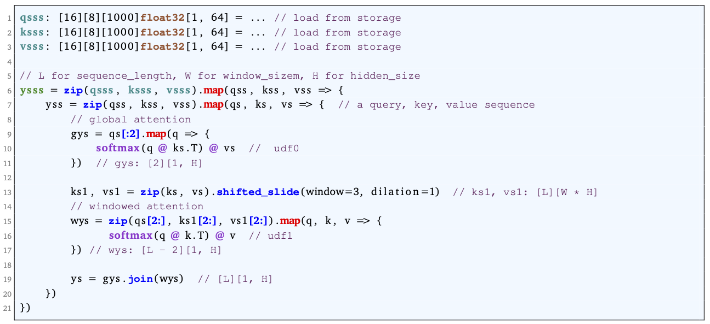
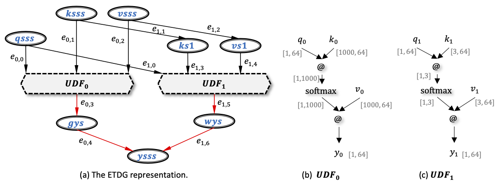
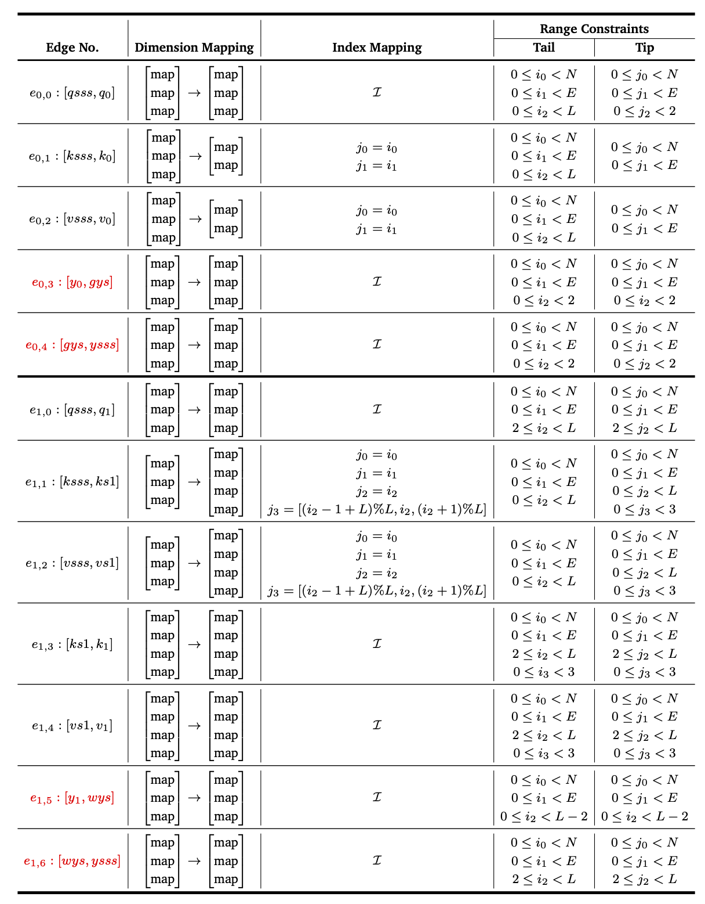
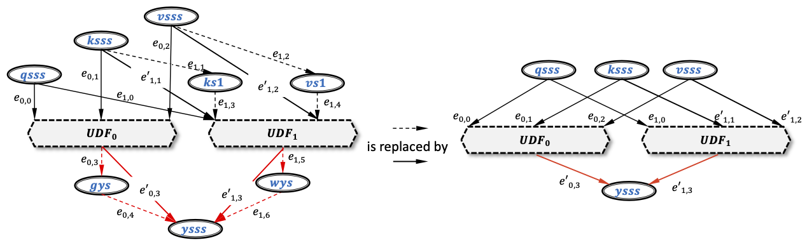
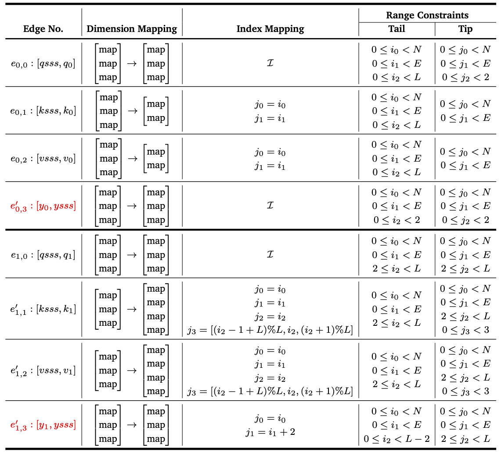

 
Fig. Compose BigBird using parallel operator nesting.

 
Fig. The parsed ETDG representation.

 
Fig. The access map annotation attached to ETDG edges.

 
Fig. Fused access map in ETDG.

 
Fig. The access map annotation attached to ETDG edges.

