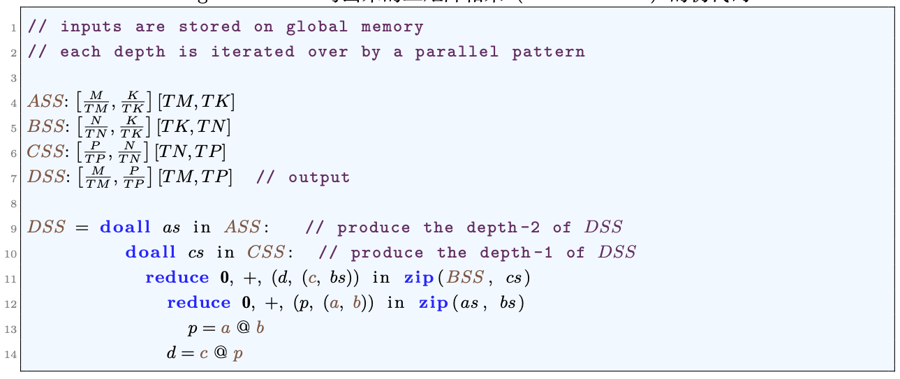
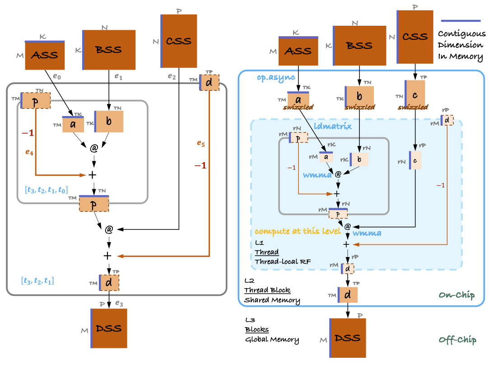
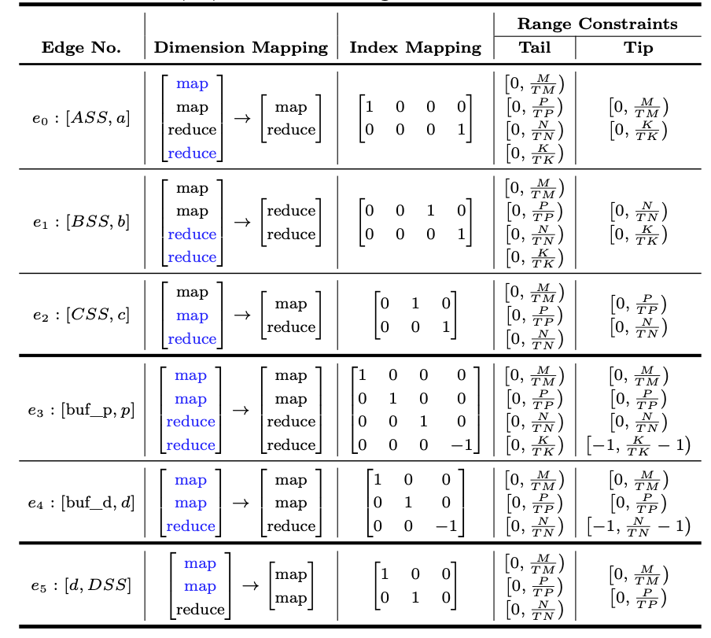
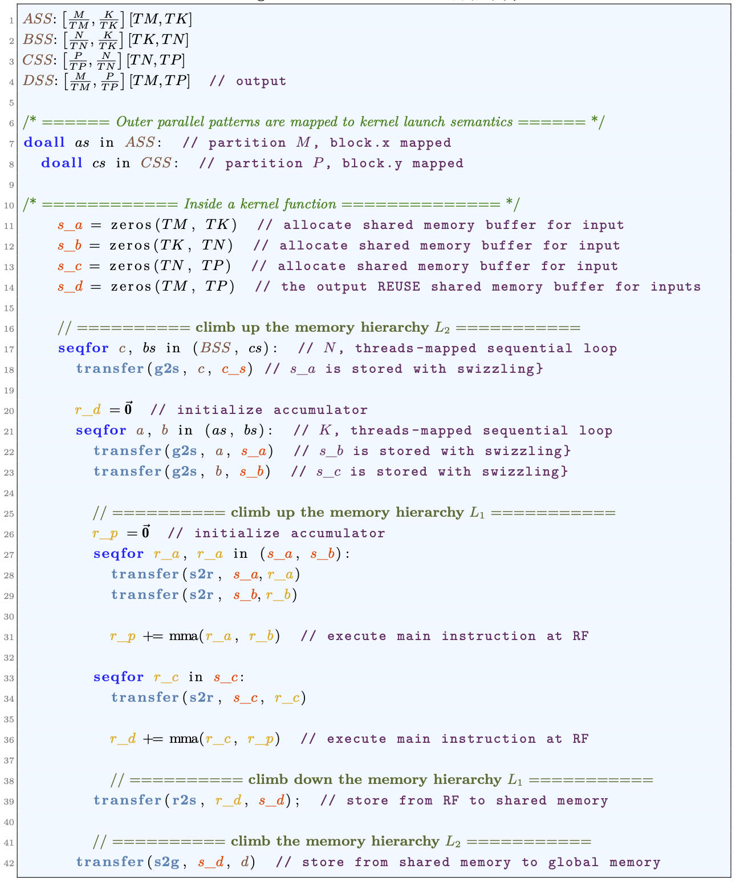

 
Fig. Compose back-to-back GEMMs using parallel operator nesting.

 
Fig. Extended task dependence graph representations for back-to-back GEMMs.

 
Fig. AccessMap annotation attached to the extended task dependence graph.

 
Fig. Translate into heirarchical dataflow on the CUDA device.

