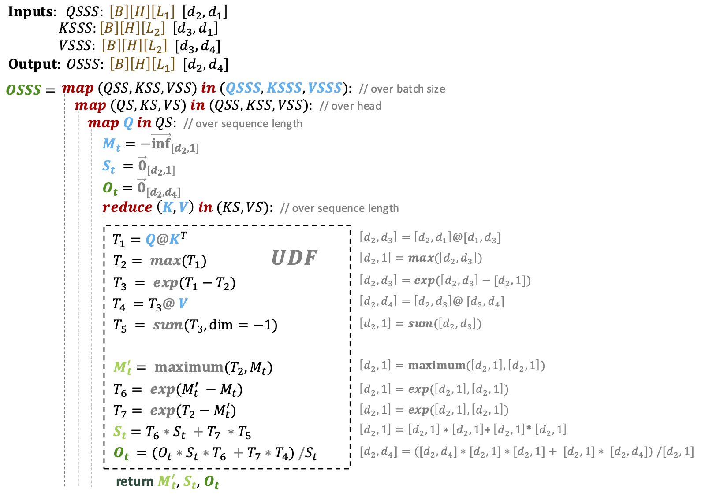
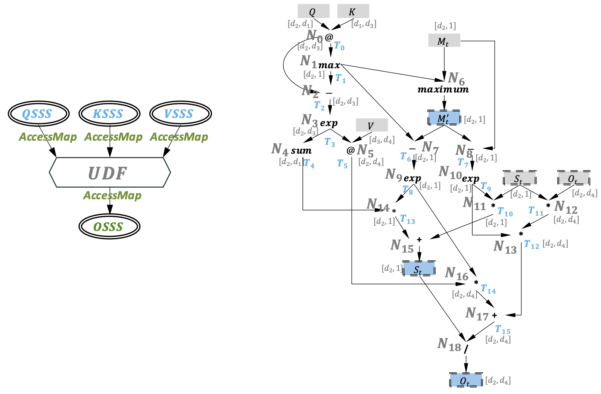
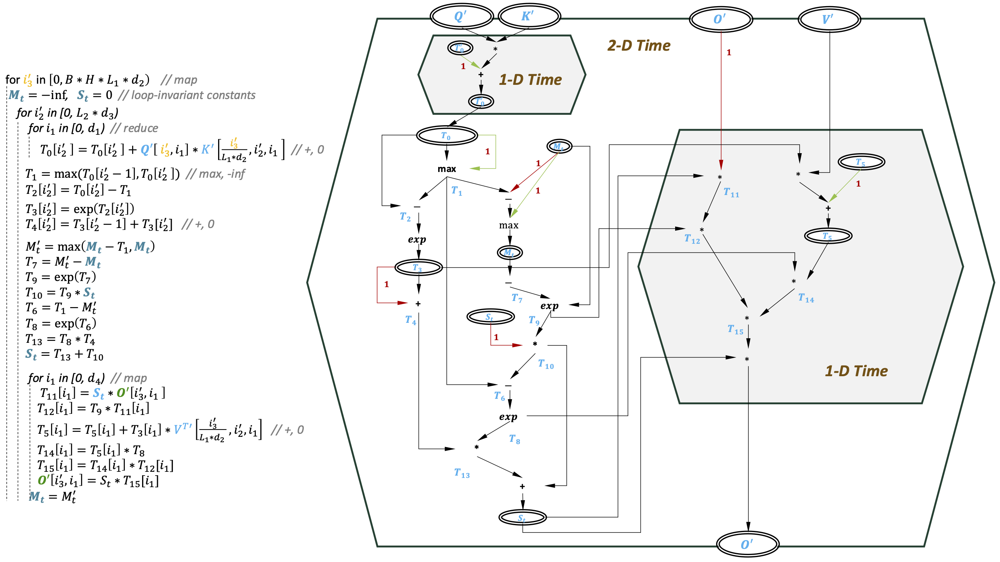
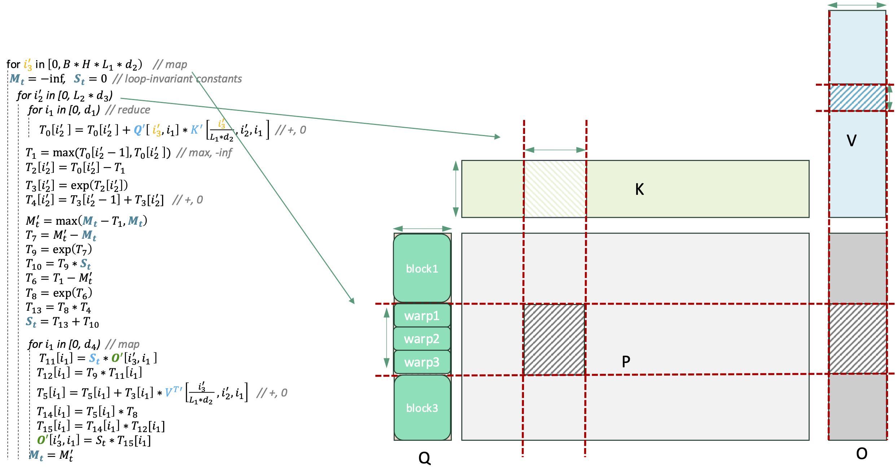

# Program Flash Attention with Parallel Operator Nesting

 
Fig. Program flash attention with parallel operator nesting.

 
Fig. Parse into nested ETDG representation.

 
Fig. Fused ETDG representation.

 
Fig. Mapping to CUDA memory and compute hierarchy (the left part represents the imperative equivalent of Fused ETDG).

