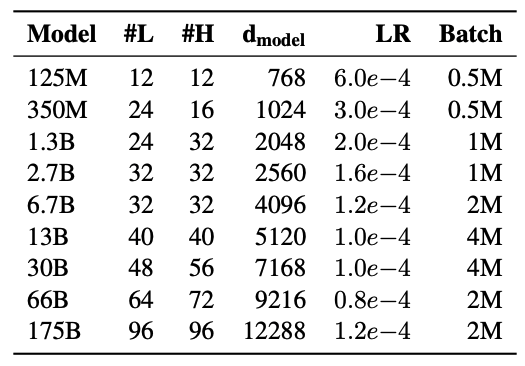

[Flash attention](https://github.com/HazyResearch/flash-attention) and Triton (```pip3 install -U --pre triton==2.0.0.dev20221202```) must be install to run this test.

# Benchmark multi-head attention

## OPT model size

<p align="center">

</br>Fig. OPT model size.
</p>

Implementations to compare:

|Methods|Codes|
|:--|:--|
|M1|[MHA using PyTorch operators](https://github.com/lcy-seso/FractalTensor/blob/master/benchmarks/multi-head_attention/baseline/MultiHeadAttention/pt_model/pt_attn.py#L87)|
|M2|[Author's original Flash Attention implementation](https://github.com/HazyResearch/flash-attention)|
|M3|[Flash Attention Triton implementation](https://github.com/HazyResearch/flash-attention/blob/main/flash_attn/flash_attn_triton.py)|
|M4|[cutlass fused MHA](https://github.com/NVIDIA/cutlass/blob/main/examples/41_fused_multi_head_attention/fused_multihead_attention_fixed_seqlen.cu)|

## Test results

1. [2080Ti](./figures/pt_data_2080Ti.tsv)
   
    ***triton and cublass fused multi-head attention can only be compiled on CUDA campability larger than 8.0.***
1. [A6000](./figures/pt_data_A6000.tsv)

1. [A100](./figures/pt_data_A100.tsv)
