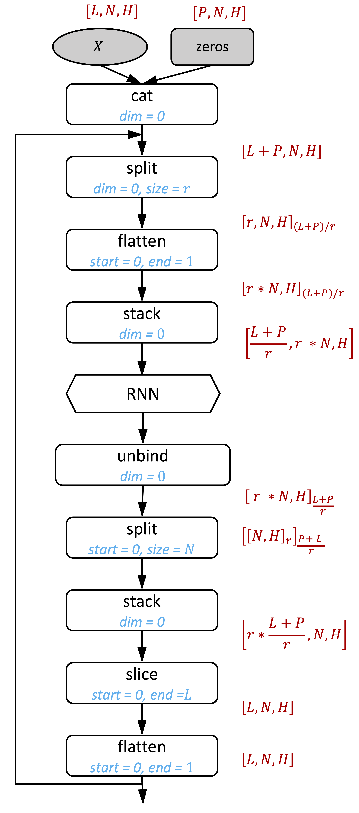

# Stacked Dilated LSTM

## PyTorch implementation

## Hyper-parameters

1. `batch_size` = 32
2. `seq_len` = 100
3. `layers_num`= 6, the corresponding `dilation`=`[1, 2, 4, 8, 16, 32]`
4. `input_size`= 64, while size means number of dims
5. `hidden_size` = `output_size` = 64
6. `rnn_cell` = `LSTM`

## Results

`counting_iteration_num` = 50, `warmup_iteration_num` = 20

|Test Name|Average Time(s)|Elapsed Time(s)|Throughput(seq/s)|
|:--|:--|:--|:--|
|PyTroch Imperative|0.0085    |0.1698 |3768.5783|
|PyTorch_JITed|0.0059      |0.1176 |5443.7788|
|PyTorch Pad per Layer (cannot be JITed)|0.0092     |0.1843 |3472.5731|
|TensorFlow Eager|0.0656  |3.2781 |488.0861|
|TensorFlow Auto-graph|0.0073  |0.3648 |4386.2863|
|TensorFlow Graph-mode|0.0051    |0.2575 |6214.1577|
