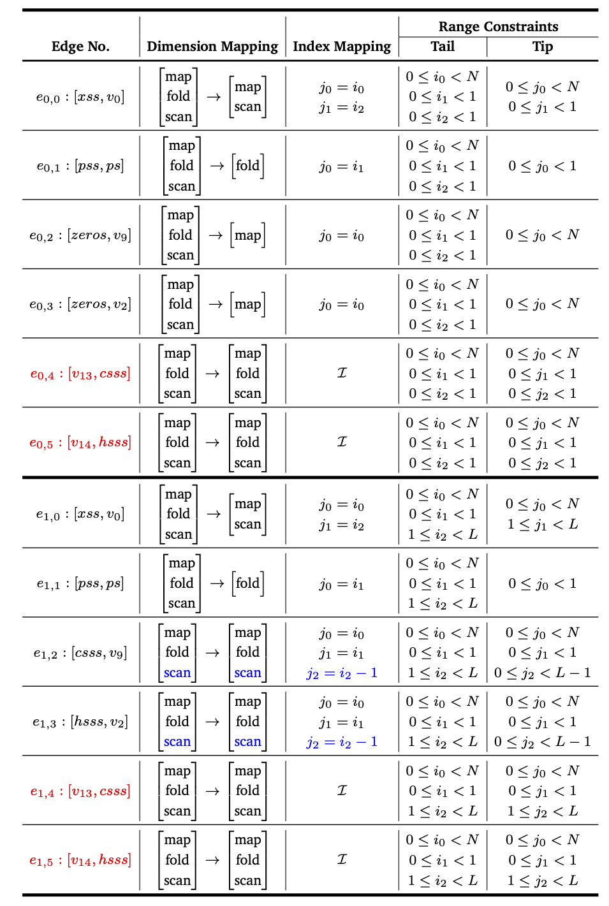
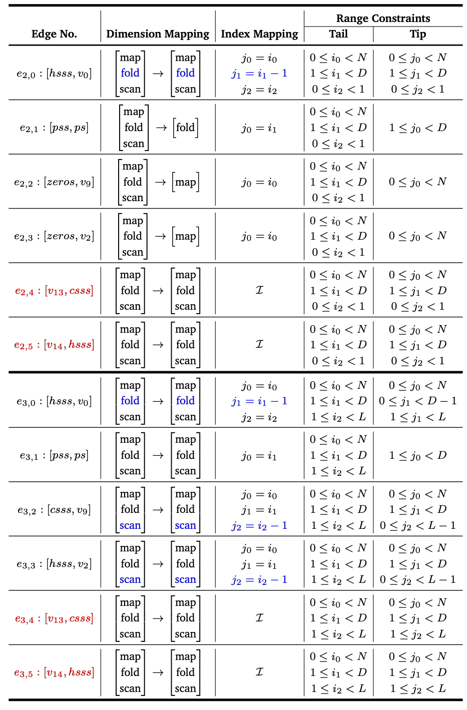
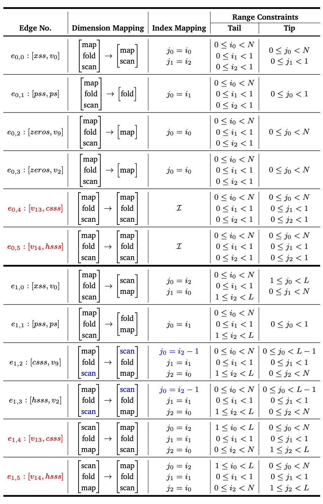
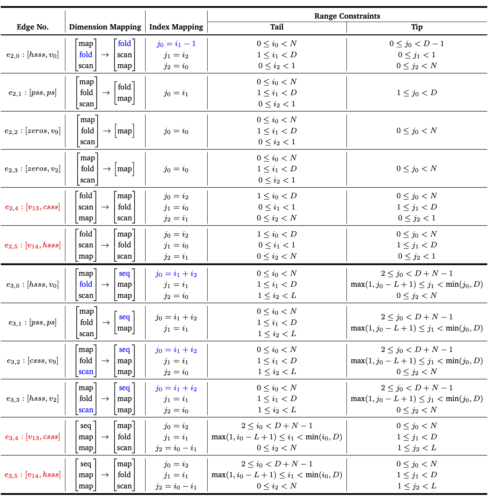

 
Fig. The ETDG representation for staked LSTM.

 
Fig. The original egde annotation for S0 and S1 before program transformation.

 
Fig. The original egde annotation for S2 and S3 before program transformation.

 
Fig. The egde annotation for S0 and S1 after program transformation.

 
Fig. The egde annotation for S2 and S3 after program transformation.