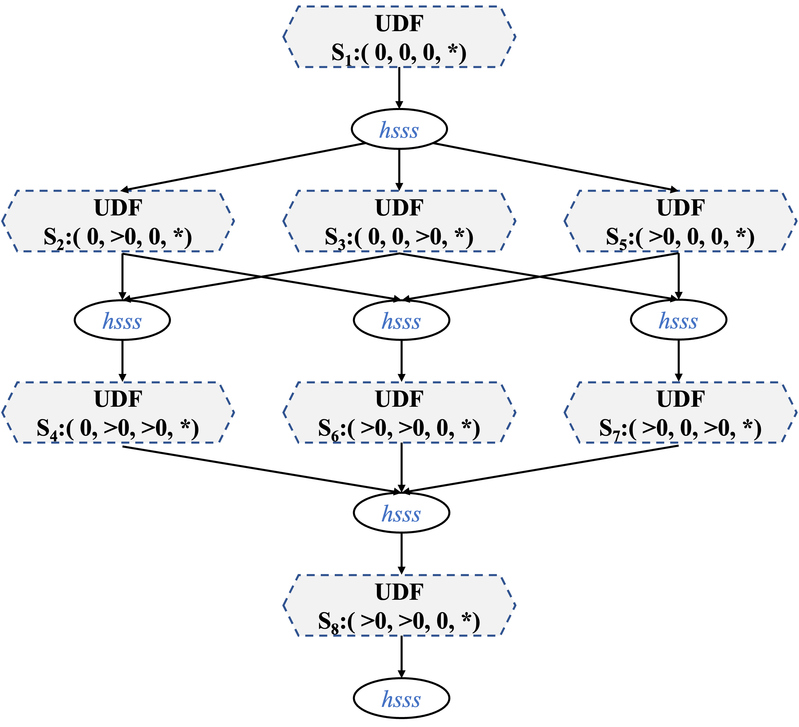

# Stacked Grid LSTM

## FractalTensor implementation

```python
for d in range(D): # depth
    for i in range(SL): # source sequence
        for j in range(TL): # target sequence
            for k in range(N): # batch
                if d == 0 and i == 0 and j == 0: # conditional branch1 
                    x_t = xss[i][k]
                    y_t = yss[i][k]
                    state_x = zeros
                    state_y = zeros
                elif d == 0 and i > 0 and j == 0: # conditional branch2
                    x_t = xss[i][k]
                    y_t = yss[i][k]
                    state_x = hsss[d][i - 1][j][0][k]
                    state_y = zeros
                elif d == 0 and i == 0 and j > 0: # conditional branch3 
                    x_t = xss[i][k]
                    y_t = yss[i][k]
                    state_x = zeros
                    state_y = hsss[d][i][j - 1][1][k]
                elif d == 0 and i > 0 and j > 0: # conditional branch4 
                    x_t = xss[i][k]
                    y_t = yss[i][k]
                    state_x = hsss[d][i - 1][j][0][k]
                    state_y = hsss[d][i][j - 1][1][k]
                elif d > 0 and i == 0 and j == 0: # conditional branch5 
                    x_t = hsss[d - 1][i][j][0][k]
                    y_t = hsss[d - 1][i][j][0][k]
                    state_x = zeros
                    state_y = zeros
                elif d > 0 and i > 0 and j == 0: # conditional branch6 
                    x_t = hsss[d - 1][i][j][0][k]
                    y_t = hsss[d - 1][i][j][0][k]
                    state_x = hsss[d][i - 1][j][0][k]
                    state_y = zeros
                elif d > 0 and i == 0 and j > 0: # conditional branch7
                    x_t = hsss[d - 1][i][j][0][k]
                    y_t = hsss[d - 1][i][j][0][k]
                    state_x = zeros
                    state_y = hsss[d][i][j - 1][1][k]
                else: # conditional branch8
                    x_t = hsss[d - 1][i][j][0][k]
                    y_t = hsss[d - 1][i][j][1][k]
                    state_x = hsss[d][i - 1][j][0][k]
                    state_y = hsss[d][i][j - 1][1][k]
                
            state = cat([state_x, state_y])
            h_x, h_y = vanilla_cells(x_t, y_t, state) 
            hsss[d][i][j][0][k] = h_x
            hsss[d][i][j][1][k] = c_y
```


## Control Regions
Convert conditional branchs to dataflow.

The data space is divided into 8 regions:

<p align="center">

</p>

### index range:
- $0 \le d < D$    , depth
- $0 \le i < SL$   , source sequence
- $0 \le j < TL$   , target sequence
- $0 \le k < N$    , batch

The transformation matrix is:

$$
\begin{bmatrix}
1 &1 &1 &0 \\
1 &0 &0 &0 \\
0 &1 &0 &0 \\
0 &0 &0 &1
\end{bmatrix}
\begin{bmatrix}
d \\
i \\
j \\
k \\
\end{bmatrix} =
\begin{bmatrix}
m \\
n \\
p \\
q \\
\end{bmatrix}
$$

The index mapping is:
$$
\begin{align*}
m &= i + j + k &&\quad d = n\\
n &= d &&\quad i = p\\
p &= i &\Longleftrightarrow&\quad j = m - n - p\\
q &= k &&\quad k = q
\end{align*}
$$

### Derive loop bound

Taking region 8 as an example, the following is the process of deriving the loop bound

$$
\begin{align}
1 \le  &\ \ n &< D  \\
1 \le  &\ \ p &< SL \\
1 \le  &\ \ m - n - p &< TL  \\
0 \le &\ \ q &< N  \\
\end{align}
$$

**1. Since the outermost loop bound must be constants, add (1), (2) and (3) together, we get**:

$$3 \le m < TL + SL+ D-2$$

**2. Bounds for the inner loop $n$ depends on $m$, and bounds for inner loop $p$ depends on $m$ and $n$**.

   
From (3) we can get:

$$
\begin{align}
m - n - TL + 1 &\le p < m - n \\
1 &\le p < SL
\end{align}
$$

Thus:

$$\text{max}(1, m - n - TL + 1) \le p < \text{min}(m - n, SL)$$

from (5) and (6) we can get:

$$\begin{align}
m - n - TL + 1 < SL  \rightarrow  m - SL - TL + 2 <= n  \\
1 < m - n  \rightarrow  n < m - 1   \\
\end{align}
$$

Thus:

$$
\text{max}(1, m - SL - TL + 2) \le n < \text{min}(m - 1, D)
$$

now, the loop bounds after affine transformation is:

$$\begin{align*}
3 \le &m < D + SL + TL - 2 \\
\text{max}(1, m - SL - TL + 2) \le &n < \text{min}(m - 1, D) \\
\text{max}(1, m - n - TL + 1) \le &p < \text{min}(m - n, SL)  \\
0 \le &q < N
\end{align*}
$$

|Region Name|Range|Projection Matrix|Index Mapping|Loop Bounds|
|:--:|:--:|:--:|:--:|:--:|
|region 1   |(0, 0, 0, *)   |[1, 0, 0, 0]<br>[0, 1, 0, 0]<br>[0, 0, 1, 0]<br>[0, 0, 0, 1]   |m = 0<br>n = 0<br>p = 0<br>q = k |m = 0<br>n = 0<br>p = 0<br>0 <= q < N  |
|region 2   |(0, >0, 0, *)  |[1, 0, 0, 0]<br>[0, 1, 0, 0]<br>[0, 0, 1, 0]<br>[0, 0, 0, 1]   |m = 0<br>n = i<br>p = 0<br>q = k |m = 0<br>1 <= n < SL<br>p = 0<br>0 <= q < N  |
|region 3   |(0, 0, >0, *)  |[1, 0, 0, 0]<br>[0, 1, 0, 0]<br>[0, 0, 1, 0]<br>[0, 0, 0, 1]   |m = 0<br>n = 0<br>p = j<br>q = k |m = 0<br>n = 0<br>1 <= p < TL<br>0 <= q < N  |
|region 4   |(0, >0, >0, *) |[1, 0, 0, 0]<br>[0, 1, 1, 0]<br>[0, 1, 0, 0]<br>[0, 0, 0, 1]   |m = 0<br>n = i + j<br>p = i<br>q = k |m = 0<br>2 <= n < SL + TL - 1<br>max(1, n - TL + 1) <= p < min(n, SL)<br>0 <= q < N  |
|region 5   |(>0, 0, 0, *)  |[1, 0, 0, 0]<br>[0, 1, 0, 0]<br>[0, 0, 1, 0]<br>[0, 0, 0, 1]   |m = d<br>n = 0<br>p = 0<br>q = k |1 <= m < D<br>n = 0<br>p = 0<br>0 <= q < N  |
|region 6   |(>0, >0, 0, *) |[1, 1, 0, 0]<br>[1, 0, 0, 0]<br>[0, 0, 1, 0]<br>[0, 0, 0, 1]   |m = d + i<br>n = d<br>p = 0<br>q = k |2 <= m < D + SL - 1<br>max(1, m - SL + 1) <= n < min(m, D)<br>p = 0<br>0 <= q < N  |
|region 7   |(>0, 0, >0, *) |[1, 0, 1, 0]<br>[0, 1, 0, 0]<br>[1, 0, 0, 0]<br>[0, 0, 0, 1]   |m = d + j<br>n = 0<br>p = d<br>q = k |2 <= m < D + TL - 1<br>max(1, m - TL + 1) <= n < min(m, D)<br>p = 0<br>0 <= q < N  |
|region 8   |(>0, >0, >0, *)|[1, 1, 1, 0]<br>[1, 0, 0, 0]<br>[0, 1, 0, 0]<br>[0, 0, 0, 1]   |m = d + i + j<br>n = d<br>p = i<br>q = k |3 <= m < D + SL + TL - 2<br>max(1, m - SL - TL + 2) <= n < min(m - 1, D)<br>max(1, m - n - TL + 1) <= p < min(m - n, SL)<br>0 <= q < N  |
