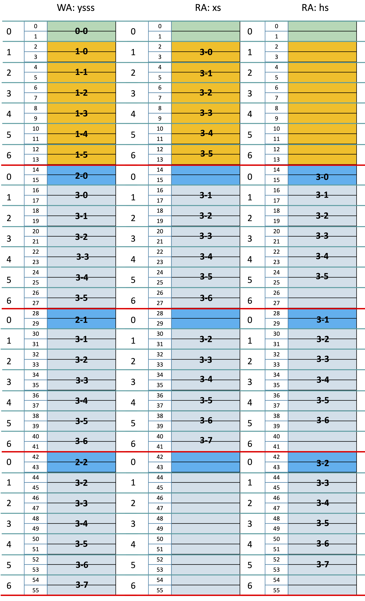
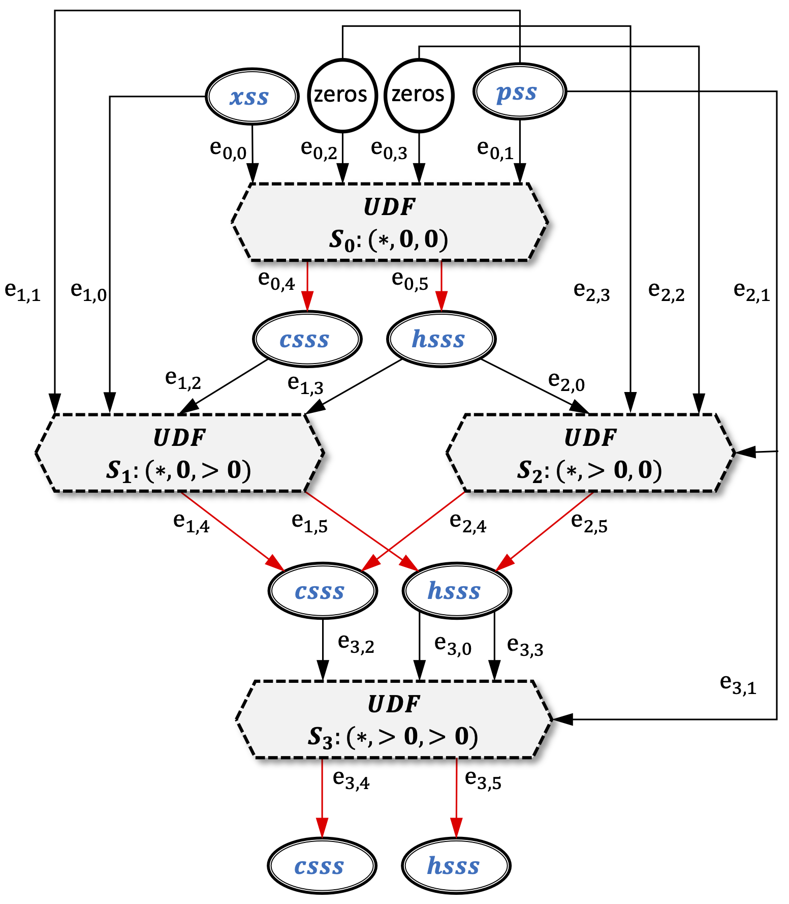
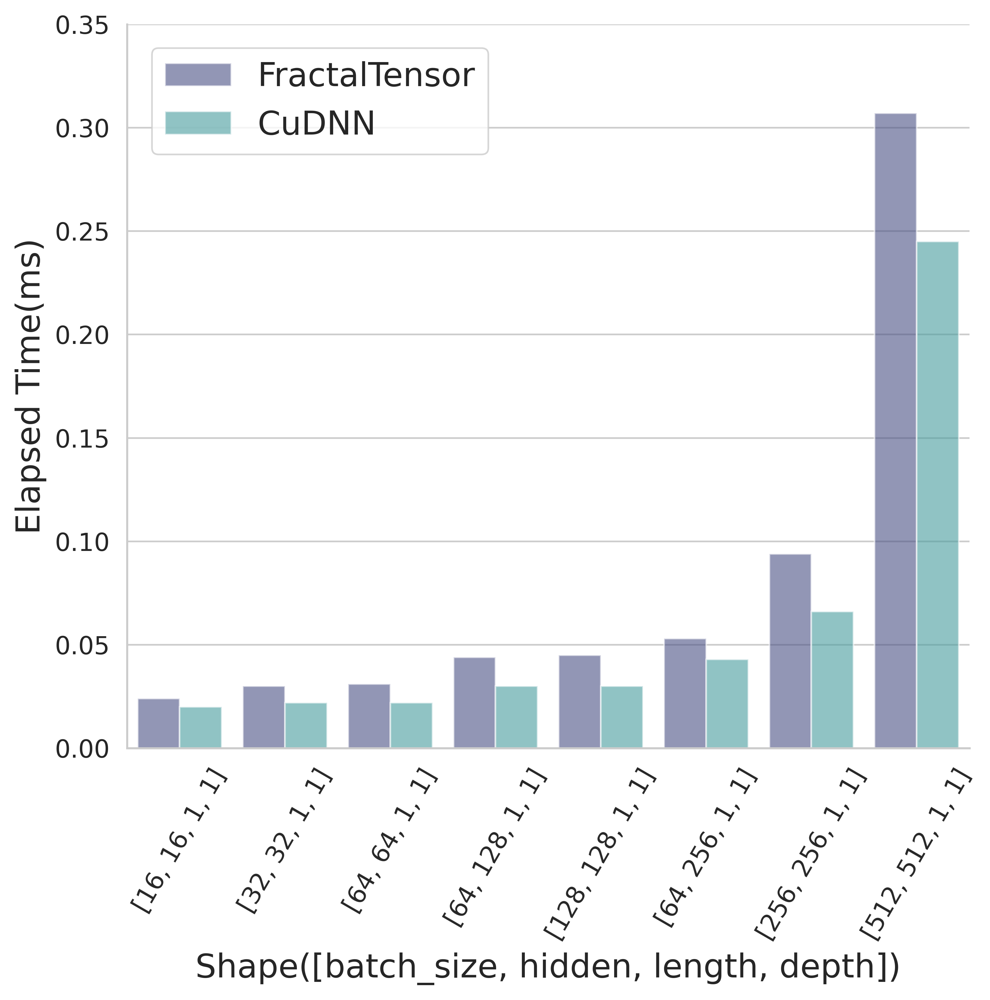
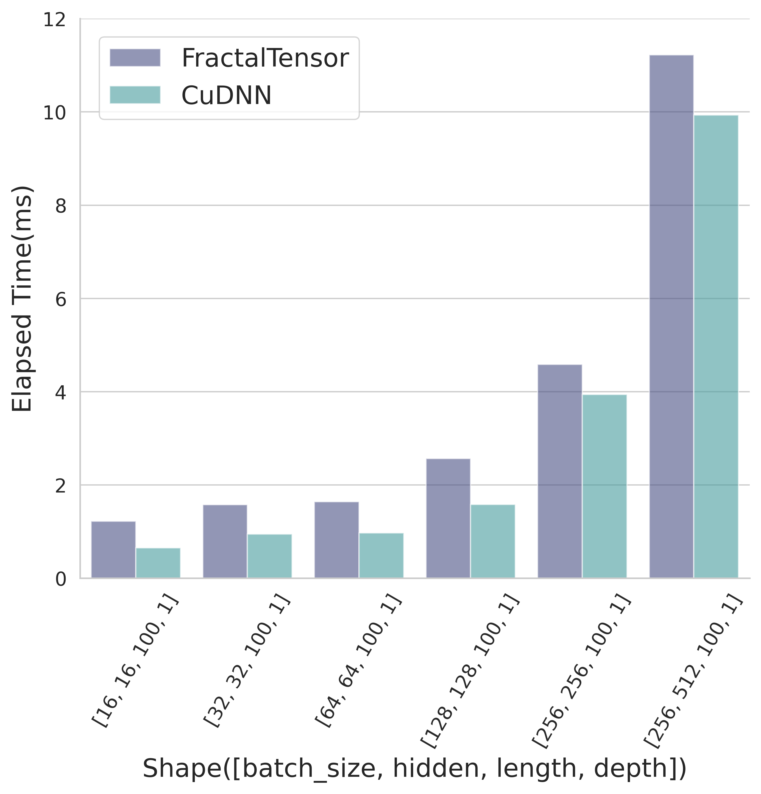
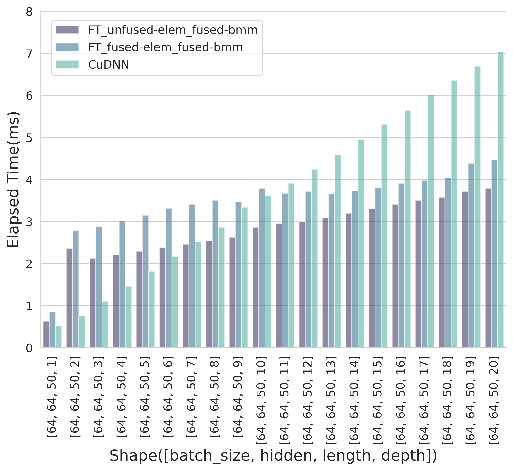
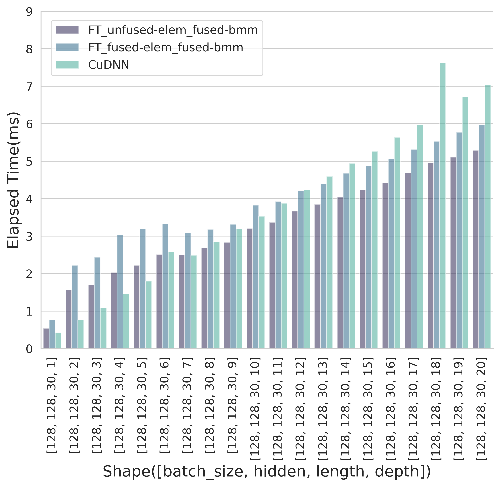
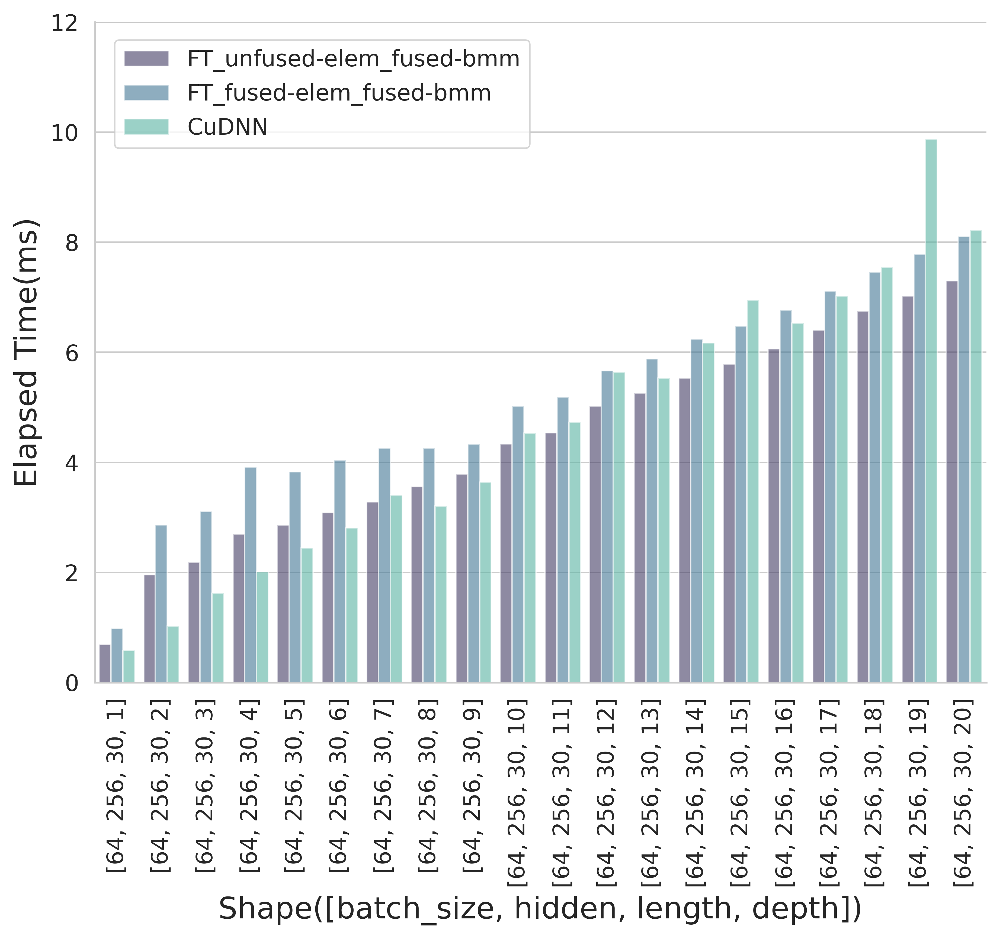

- [Methods](#methods)
- [Test Results](#test-results)
  - [Cell](#cell)
  - [A Single Layer](#a-single-layer)
  - [Multiple Layers](#multiple-layers)

# Methods

Below is a small test case to illustrate the idea:

- batch_size = 2
- length = 7
- depth = 4
- `ysss` is laid out in `[depth, length, batch_size]`

<p align="center">

</p>

In this small, it is easy to observe that, within a hyperplance, parallel iterations that access `ysss`, `xs` and `hs` **follows a fixed stride**, thus `xs @ W` and `hs @ U` can be translated into `stridedBMM`.

|No.|ysss|xs|hs|
|:-:|:-:|:-:|:-:|
|3-0|[16]|[2]|[14]|
|3-1|[18,30]|[4,16]|[16,28]|
|3-2|[20,32,44]|[6,18,30]|[18,30,42]|
|3-3|[22,32,44]|[8,20,32]|[20,32,44]|
|3-4|[24,36,48]|[10,22,34]|[22,34,46]|
|3-5|[26,38,50]|[12,24,36]|[24,36,48]|
|3-6|[40,52]|[26,38]|[38,50]|
|3-7|[54]|[40]|[52]|

<p align="center">
<br>
Fig. The dataflow graph representation for the stacked LSTM network.
</p>

# Test Results

``` {.text}
OS: Ubuntu 16.04.7 LTS
TensorFlow version: 2.2.3, compiled by gcc 5.0
PyTorch v1.9.0
CUDA Version 11.6
CUDNN Version 8.4.1

GeForce RTX 2080 Ti, Compute Capability 7.5
```

The second column `Shape` stands for `[batch_size, hidden_size, length, depth]`.

## Cell

Fuse all element-wise computations in a single kernel.

||Shape|Gather(ms)|Cell-GEMM(ms)|Cell-Elementwise(ms)|Scatter(ms)|Total(ms)|
|:--:|:--:|:--:|:--:|:--:|:--:|:--:|
|FractalTensor|[16, 16, 1, 1]|0.004|0.016|0.005|0.000|0.024|
|CuDNN|[16, 16, 1, 1]|||||0.020|
|FractalTensor|[32, 32, 1, 1]|0.003|0.022|0.005|0.000|0.030|
|CuDNN|[32, 32, 1, 1]|||||0.022|
|FractalTensor|[64, 64, 1, 1]|0.004|0.022|0.005|0.000|0.031|
|CuDNN|[64, 64, 1, 1]|||||0.022|
|FractalTensor|[64, 128, 1, 1]|0.004|0.035|0.006|0.000|0.044|
|CuDNN|[64, 128, 1, 1]|||||0.030|
|FractalTensor|[128, 128, 1, 1]|0.004|0.035|0.007|0.000|0.045|
|CuDNN|[128, 128, 1, 1]|||||0.030|
|FractalTensor|[64, 256, 1, 1]|0.004|0.042|0.007|0.000|0.053|
|CuDNN|[64, 256, 1, 1]|||||0.043|
|FractalTensor|[256, 256, 1, 1]|0.004|0.075|0.015|0.000|0.094|
|CuDNN|[256, 256, 1, 1]|||||0.066|
|FractalTensor|[512, 512, 1, 1]|0.005|0.253|0.049|0.000|0.307|
|CuDNN|[512, 512, 1, 1]|||||0.245|
|FractalTensor|[1024, 1024, 1, 1]|0.013|1.643|0.178|0.000|1.834|
|CuDNN|[1024, 1024, 1, 1]|||||1.750|
|FractalTensor|[2048, 2048, 1, 1]|0.034|11.998|0.642|0.000|12.675|
|CuDNN|[2048, 2048, 1, 1]|||||9.496|

<p align="center">

</p>

## A Single Layer

||Shape|Gather(ms)|Cell-GEMM(ms)|Cell-Elementwise(ms)|Scatter(ms)|Total(ms)|
|:--:|:--:|:--:|:--:|:--:|:--:|:--:|
|FractalTensor|[16, 16, 100, 1]|0.004|0.733|0.486|0.000|1.223|
|CuDNN|[16, 16, 100, 1]|||||0.653|
|FractalTensor|[32, 32, 100, 1]|0.003|1.038|0.536|0.000|1.578|
|CuDNN|[32, 32, 100, 1]|||||0.949|
|FractalTensor|[64, 64, 100, 1]|0.003|1.091|0.546|0.000|1.641|
|CuDNN|[64, 64, 100, 1]|||||0.970|
|FractalTensor|[128, 128, 100, 1]|0.004|1.841|0.720|0.000|2.565|
|CuDNN|[128, 128, 100, 1]|||||1.580|
|FractalTensor|[256, 256, 100, 1]|0.003|3.454|1.126|0.000|4.584|
|CuDNN|[256, 256, 100, 1]|||||3.940|
|FractalTensor|[256, 512, 100, 1]|0.003|9.306|1.913|0.000|11.223|
|CuDNN|[256, 512, 100, 1]|||||9.932|
<p align="center">

</p>

## Multiple Layers

<p align="center">




</p>

||Shape|Gather(ms)|Cell-GEMM(ms)|Cell-Elementwise(ms)|Scatter(ms)|Total(ms)|
|:--:|:--:|:--:|:--:|:--:|:--:|:--:|
|FT_unfused-elem_fused-bmm|[64, 64, 50, 1]|0.004|0.419|0.203|0.000|0.626|
|FT_fused-elem_fused-bmm|[64, 64, 50, 1]|0.004|0.573|0.275|0.000|0.852|
|CuDNN|[64, 64, 50, 1]|||||0.518|
|FT_unfused-elem_fused-bmm|[64, 64, 50, 2]|0.013|1.599|0.381|0.364|2.357|
|FT_fused-elem_fused-bmm|[64, 64, 50, 2]|0.021|1.831|0.538|0.393|2.784|
|CuDNN|[64, 64, 50, 2]|||||0.752|
|FT_unfused-elem_fused-bmm|[64, 64, 50, 3]|0.012|1.447|0.347|0.317|2.124|
|FT_fused-elem_fused-bmm|[64, 64, 50, 3]|0.022|1.889|0.566|0.403|2.879|
|CuDNN|[64, 64, 50, 3]|||||1.099|
|FT_unfused-elem_fused-bmm|[64, 64, 50, 4]|0.012|1.504|0.363|0.326|2.206|
|FT_fused-elem_fused-bmm|[64, 64, 50, 4]|0.022|1.948|0.631|0.416|3.016|
|CuDNN|[64, 64, 50, 4]|||||1.461|
|FT_unfused-elem_fused-bmm|[64, 64, 50, 5]|0.013|1.571|0.370|0.338|2.291|
|FT_fused-elem_fused-bmm|[64, 64, 50, 5]|0.022|2.036|0.658|0.429|3.144|
|CuDNN|[64, 64, 50, 5]|||||1.811|
|FT_unfused-elem_fused-bmm|[64, 64, 50, 6]|0.012|1.623|0.396|0.349|2.379|
|FT_fused-elem_fused-bmm|[64, 64, 50, 6]|0.022|2.079|0.773|0.439|3.313|
|CuDNN|[64, 64, 50, 6]|||||2.170|
|FT_unfused-elem_fused-bmm|[64, 64, 50, 7]|0.012|1.677|0.410|0.358|2.458|
|FT_fused-elem_fused-bmm|[64, 64, 50, 7]|0.022|2.146|0.794|0.448|3.410|
|CuDNN|[64, 64, 50, 7]|||||2.519|
|FT_unfused-elem_fused-bmm|[64, 64, 50, 8]|0.012|1.740|0.422|0.363|2.537|
|FT_fused-elem_fused-bmm|[64, 64, 50, 8]|0.021|2.212|0.808|0.456|3.498|
|CuDNN|[64, 64, 50, 8]|||||2.864|
|FT_unfused-elem_fused-bmm|[64, 64, 50, 9]|0.012|1.803|0.431|0.375|2.621|
|FT_fused-elem_fused-bmm|[64, 64, 50, 9]|0.022|2.201|0.791|0.448|3.463|
|CuDNN|[64, 64, 50, 9]|||||3.336|
|FT_unfused-elem_fused-bmm|[64, 64, 50, 10]|0.012|2.006|0.448|0.391|2.858|
|FT_fused-elem_fused-bmm|[64, 64, 50, 10]|0.021|2.387|0.935|0.443|3.786|
|CuDNN|[64, 64, 50, 10]|||||3.615|
|FT_unfused-elem_fused-bmm|[64, 64, 50, 11]|0.013|2.072|0.465|0.403|2.952|
|FT_fused-elem_fused-bmm|[64, 64, 50, 11]|0.022|2.321|0.893|0.431|3.666|
|CuDNN|[64, 64, 50, 11]|||||3.909|
|FT_unfused-elem_fused-bmm|[64, 64, 50, 12]|0.012|2.104|0.475|0.406|2.997|
|FT_fused-elem_fused-bmm|[64, 64, 50, 12]|0.022|2.354|0.906|0.432|3.714|
|CuDNN|[64, 64, 50, 12]|||||4.237|
|FT_unfused-elem_fused-bmm|[64, 64, 50, 13]|0.013|2.154|0.499|0.423|3.090|
|FT_fused-elem_fused-bmm|[64, 64, 50, 13]|0.020|2.332|0.882|0.424|3.658|
|CuDNN|[64, 64, 50, 13]|||||4.591|
|FT_unfused-elem_fused-bmm|[64, 64, 50, 14]|0.012|2.232|0.520|0.429|3.192|
|FT_fused-elem_fused-bmm|[64, 64, 50, 14]|0.022|2.388|0.890|0.428|3.728|
|CuDNN|[64, 64, 50, 14]|||||4.955|
|FT_unfused-elem_fused-bmm|[64, 64, 50, 15]|0.013|2.280|0.565|0.440|3.298|
|FT_fused-elem_fused-bmm|[64, 64, 50, 15]|0.021|2.427|0.914|0.437|3.799|
|CuDNN|[64, 64, 50, 15]|||||5.313|
|FT_unfused-elem_fused-bmm|[64, 64, 50, 16]|0.013|2.335|0.602|0.453|3.403|
|FT_fused-elem_fused-bmm|[64, 64, 50, 16]|0.021|2.493|0.940|0.450|3.903|
|CuDNN|[64, 64, 50, 16]|||||5.641|
|FT_unfused-elem_fused-bmm|[64, 64, 50, 17]|0.014|2.391|0.637|0.460|3.501|
|FT_fused-elem_fused-bmm|[64, 64, 50, 17]|0.021|2.544|0.955|0.454|3.974|
|CuDNN|[64, 64, 50, 17]|||||6.008|
|FT_unfused-elem_fused-bmm|[64, 64, 50, 18]|0.013|2.420|0.668|0.471|3.571|
|FT_fused-elem_fused-bmm|[64, 64, 50, 18]|0.023|2.576|0.973|0.464|4.036|
|CuDNN|[64, 64, 50, 18]|||||6.353|
|FT_unfused-elem_fused-bmm|[64, 64, 50, 19]|0.013|2.481|0.686|0.533|3.713|
|FT_fused-elem_fused-bmm|[64, 64, 50, 19]|0.022|2.635|1.212|0.510|4.378|
|CuDNN|[64, 64, 50, 19]|||||6.694|
|FT_unfused-elem_fused-bmm|[64, 64, 50, 20]|0.013|2.529|0.702|0.545|3.789|
|FT_fused-elem_fused-bmm|[64, 64, 50, 20]|0.022|2.683|1.237|0.523|4.465|
|CuDNN|[64, 64, 50, 20]|||||7.038|

||Shape|Gather(ms)|Cell-GEMM(ms)|Cell-Elementwise(ms)|Scatter(ms)|Total(ms)|
|:--:|:--:|:--:|:--:|:--:|:--:|:--:|
|FT_unfused-elem_fused-bmm|[64, 128, 50, 1]|0.003|0.521|0.211|0.000|0.736|
|FT_fused-elem_fused-bmm|[64, 128, 50, 1]|0.003|0.903|0.303|0.000|1.209|
|CuDNN|[64, 128, 50, 1]|||||0.570|
|FT_unfused-elem_fused-bmm|[64, 128, 50, 2]|0.013|1.753|0.360|0.318|2.443|
|FT_fused-elem_fused-bmm|[64, 128, 50, 2]|0.021|2.535|0.595|0.391|3.541|
|CuDNN|[64, 128, 50, 2]|||||1.946|
|FT_unfused-elem_fused-bmm|[64, 128, 50, 3]|0.014|2.069|0.443|0.384|2.910|
|FT_fused-elem_fused-bmm|[64, 128, 50, 3]|0.021|2.654|0.657|0.399|3.731|
|CuDNN|[64, 128, 50, 3]|||||1.980|
|FT_unfused-elem_fused-bmm|[64, 128, 50, 4]|0.013|1.949|0.418|0.342|2.721|
|FT_fused-elem_fused-bmm|[64, 128, 50, 4]|0.020|2.742|0.792|0.420|3.975|
|CuDNN|[64, 128, 50, 4]|||||2.251|
|FT_unfused-elem_fused-bmm|[64, 128, 50, 5]|0.012|2.028|0.422|0.350|2.812|
|FT_fused-elem_fused-bmm|[64, 128, 50, 5]|0.022|2.802|0.788|0.417|4.029|
|CuDNN|[64, 128, 50, 5]|||||2.740|
|FT_unfused-elem_fused-bmm|[64, 128, 50, 6]|0.013|2.427|0.454|0.376|3.271|
|FT_fused-elem_fused-bmm|[64, 128, 50, 6]|0.020|3.173|0.950|0.411|4.553|
|CuDNN|[64, 128, 50, 6]|||||3.307|
|FT_unfused-elem_fused-bmm|[64, 128, 50, 7]|0.013|2.512|0.493|0.388|3.407|
|FT_fused-elem_fused-bmm|[64, 128, 50, 7]|0.022|2.951|0.865|0.382|4.220|
|CuDNN|[64, 128, 50, 7]|||||3.792|
|FT_unfused-elem_fused-bmm|[64, 128, 50, 8]|0.012|2.594|0.507|0.405|3.518|
|FT_fused-elem_fused-bmm|[64, 128, 50, 8]|0.018|3.015|0.881|0.388|4.301|
|CuDNN|[64, 128, 50, 8]|||||4.375|
|FT_unfused-elem_fused-bmm|[64, 128, 50, 9]|0.012|2.667|0.525|0.412|3.617|
|FT_fused-elem_fused-bmm|[64, 128, 50, 9]|0.021|3.070|0.889|0.405|4.384|
|CuDNN|[64, 128, 50, 9]|||||4.890|
|FT_unfused-elem_fused-bmm|[64, 128, 50, 10]|0.012|2.761|0.560|0.493|3.827|
|FT_fused-elem_fused-bmm|[64, 128, 50, 10]|0.023|3.166|1.207|0.479|4.876|
|CuDNN|[64, 128, 50, 10]|||||5.385|
|FT_unfused-elem_fused-bmm|[64, 128, 50, 11]|0.012|2.853|0.587|0.508|3.961|
|FT_fused-elem_fused-bmm|[64, 128, 50, 11]|0.021|3.231|1.235|0.497|4.984|
|CuDNN|[64, 128, 50, 11]|||||8.496|
|FT_unfused-elem_fused-bmm|[64, 128, 50, 12]|0.013|3.024|0.643|0.540|4.219|
|FT_fused-elem_fused-bmm|[64, 128, 50, 12]|0.022|3.321|1.267|0.511|5.121|
|CuDNN|[64, 128, 50, 12]|||||6.490|
|FT_unfused-elem_fused-bmm|[64, 128, 50, 13]|0.012|3.028|0.659|0.544|4.244|
|FT_fused-elem_fused-bmm|[64, 128, 50, 13]|0.021|3.431|1.295|0.521|5.267|
|CuDNN|[64, 128, 50, 13]|||||9.745|
|FT_unfused-elem_fused-bmm|[64, 128, 50, 14]|0.012|3.183|0.709|0.560|4.465|
|FT_fused-elem_fused-bmm|[64, 128, 50, 14]|0.021|3.550|1.325|0.545|5.440|
|CuDNN|[64, 128, 50, 14]|||||8.835|
|FT_unfused-elem_fused-bmm|[64, 128, 50, 15]|0.013|3.284|0.759|0.575|4.631|
|FT_fused-elem_fused-bmm|[64, 128, 50, 15]|0.021|3.655|1.344|0.555|5.575|
|CuDNN|[64, 128, 50, 15]|||||8.063|
|FT_unfused-elem_fused-bmm|[64, 128, 50, 16]|0.012|3.373|0.789|0.591|4.766|
|FT_fused-elem_fused-bmm|[64, 128, 50, 16]|0.022|3.758|1.376|0.577|5.734|
|CuDNN|[64, 128, 50, 16]|||||8.620|
|FT_unfused-elem_fused-bmm|[64, 128, 50, 17]|0.012|3.470|0.834|0.604|4.920|
|FT_fused-elem_fused-bmm|[64, 128, 50, 17]|0.021|3.843|1.405|0.579|5.847|
|CuDNN|[64, 128, 50, 17]|||||9.136|
|FT_unfused-elem_fused-bmm|[64, 128, 50, 18]|0.012|3.565|0.876|0.615|5.069|
|FT_fused-elem_fused-bmm|[64, 128, 50, 18]|0.022|3.955|1.418|0.597|5.992|
|CuDNN|[64, 128, 50, 18]|||||9.647|
|FT_unfused-elem_fused-bmm|[64, 128, 50, 19]|0.013|3.883|0.932|0.675|5.502|
|FT_fused-elem_fused-bmm|[64, 128, 50, 19]|0.020|4.272|1.690|0.653|6.635|
|CuDNN|[64, 128, 50, 19]|||||10.239|
|FT_unfused-elem_fused-bmm|[64, 128, 50, 20]|0.013|3.971|0.983|0.689|5.655|
|FT_fused-elem_fused-bmm|[64, 128, 50, 20]|0.021|4.357|1.731|0.664|6.772|
|CuDNN|[64, 128, 50, 20]|||||13.340|

||Shape|Gather(ms)|Cell-GEMM(ms)|Cell-Elementwise(ms)|Scatter(ms)|Total(ms)|
|:--:|:--:|:--:|:--:|:--:|:--:|:--:|
|FT_unfused-elem_fused-bmm|[128, 128, 30, 1]|0.003|0.392|0.145|0.000|0.540|
|FT_fused-elem_fused-bmm|[128, 128, 30, 1]|0.003|0.555|0.214|0.000|0.771|
|CuDNN|[128, 128, 30, 1]|||||0.427|
|FT_unfused-elem_fused-bmm|[128, 128, 30, 2]|0.012|1.135|0.236|0.187|1.570|
|FT_fused-elem_fused-bmm|[128, 128, 30, 2]|0.020|1.551|0.415|0.237|2.223|
|CuDNN|[128, 128, 30, 2]|||||0.762|
|FT_unfused-elem_fused-bmm|[128, 128, 30, 3]|0.012|1.234|0.261|0.198|1.704|
|FT_fused-elem_fused-bmm|[128, 128, 30, 3]|0.020|1.662|0.506|0.252|2.440|
|CuDNN|[128, 128, 30, 3]|||||1.085|
|FT_unfused-elem_fused-bmm|[128, 128, 30, 4]|0.012|1.509|0.291|0.217|2.029|
|FT_fused-elem_fused-bmm|[128, 128, 30, 4]|0.020|2.079|0.659|0.272|3.031|
|CuDNN|[128, 128, 30, 4]|||||1.458|
|FT_unfused-elem_fused-bmm|[128, 128, 30, 5]|0.013|1.595|0.376|0.235|2.218|
|FT_fused-elem_fused-bmm|[128, 128, 30, 5]|0.020|2.200|0.693|0.286|3.199|
|CuDNN|[128, 128, 30, 5]|||||1.800|
|FT_unfused-elem_fused-bmm|[128, 128, 30, 6]|0.014|1.762|0.434|0.301|2.511|
|FT_fused-elem_fused-bmm|[128, 128, 30, 6]|0.021|2.109|0.875|0.322|3.327|
|CuDNN|[128, 128, 30, 6]|||||2.580|
|FT_unfused-elem_fused-bmm|[128, 128, 30, 7]|0.012|1.764|0.425|0.305|2.507|
|FT_fused-elem_fused-bmm|[128, 128, 30, 7]|0.021|1.968|0.798|0.306|3.094|
|CuDNN|[128, 128, 30, 7]|||||2.492|
|FT_unfused-elem_fused-bmm|[128, 128, 30, 8]|0.013|1.888|0.469|0.323|2.692|
|FT_fused-elem_fused-bmm|[128, 128, 30, 8]|0.021|2.035|0.802|0.319|3.177|
|CuDNN|[128, 128, 30, 8]|||||2.851|
|FT_unfused-elem_fused-bmm|[128, 128, 30, 9]|0.012|1.982|0.508|0.334|2.835|
|FT_fused-elem_fused-bmm|[128, 128, 30, 9]|0.021|2.135|0.831|0.331|3.318|
|CuDNN|[128, 128, 30, 9]|||||3.199|
|FT_unfused-elem_fused-bmm|[128, 128, 30, 10]|0.033|2.222|0.571|0.377|3.204|
|FT_fused-elem_fused-bmm|[128, 128, 30, 10]|0.068|2.376|1.013|0.371|3.828|
|CuDNN|[128, 128, 30, 10]|||||3.533|
|FT_unfused-elem_fused-bmm|[128, 128, 30, 11]|0.012|2.327|0.630|0.397|3.367|
|FT_fused-elem_fused-bmm|[128, 128, 30, 11]|0.021|2.462|1.052|0.389|3.924|
|CuDNN|[128, 128, 30, 11]|||||3.878|
|FT_unfused-elem_fused-bmm|[128, 128, 30, 12]|0.012|2.562|0.680|0.416|3.671|
|FT_fused-elem_fused-bmm|[128, 128, 30, 12]|0.021|2.693|1.091|0.409|4.215|
|CuDNN|[128, 128, 30, 12]|||||4.232|
|FT_unfused-elem_fused-bmm|[128, 128, 30, 13]|0.012|2.667|0.736|0.432|3.846|
|FT_fused-elem_fused-bmm|[128, 128, 30, 13]|0.020|2.809|1.138|0.434|4.400|
|CuDNN|[128, 128, 30, 13]|||||4.593|
|FT_unfused-elem_fused-bmm|[128, 128, 30, 14]|0.012|2.774|0.786|0.471|4.043|
|FT_fused-elem_fused-bmm|[128, 128, 30, 14]|0.021|2.914|1.281|0.464|4.680|
|CuDNN|[128, 128, 30, 14]|||||4.941|
|FT_unfused-elem_fused-bmm|[128, 128, 30, 15]|0.012|2.897|0.840|0.494|4.243|
|FT_fused-elem_fused-bmm|[128, 128, 30, 15]|0.022|3.031|1.330|0.491|4.874|
|CuDNN|[128, 128, 30, 15]|||||5.260|
|FT_unfused-elem_fused-bmm|[128, 128, 30, 16]|0.013|3.002|0.890|0.513|4.418|
|FT_fused-elem_fused-bmm|[128, 128, 30, 16]|0.021|3.145|1.378|0.517|5.062|
|CuDNN|[128, 128, 30, 16]|||||5.639|
|FT_unfused-elem_fused-bmm|[128, 128, 30, 17]|0.012|3.204|0.940|0.538|4.694|
|FT_fused-elem_fused-bmm|[128, 128, 30, 17]|0.021|3.326|1.427|0.540|5.314|
|CuDNN|[128, 128, 30, 17]|||||5.972|
|FT_unfused-elem_fused-bmm|[128, 128, 30, 18]|0.013|3.368|1.007|0.567|4.954|
|FT_fused-elem_fused-bmm|[128, 128, 30, 18]|0.021|3.453|1.489|0.567|5.530|
|CuDNN|[128, 128, 30, 18]|||||7.620|
|FT_unfused-elem_fused-bmm|[128, 128, 30, 19]|0.013|3.461|1.046|0.589|5.108|
|FT_fused-elem_fused-bmm|[128, 128, 30, 19]|0.021|3.566|1.592|0.595|5.774|
|CuDNN|[128, 128, 30, 19]|||||6.718|
|FT_unfused-elem_fused-bmm|[128, 128, 30, 20]|0.012|3.561|1.095|0.616|5.285|
|FT_fused-elem_fused-bmm|[128, 128, 30, 20]|0.021|3.682|1.649|0.621|5.973|
|CuDNN|[128, 128, 30, 20]|||||7.038|

||Shape|Gather(ms)|Cell-GEMM(ms)|Cell-Elementwise(ms)|Scatter(ms)|Total(ms)|
|:--:|:--:|:--:|:--:|:--:|:--:|:--:|
|FT_unfused-elem_fused-bmm|[64, 256, 30, 1]|0.003|0.544|0.142|0.000|0.689|
|FT_fused-elem_fused-bmm|[64, 256, 30, 1]|0.004|0.761|0.217|0.000|0.982|
|CuDNN|[64, 256, 30, 1]|||||0.581|
|FT_unfused-elem_fused-bmm|[64, 256, 30, 2]|0.012|1.529|0.233|0.186|1.961|
|FT_fused-elem_fused-bmm|[64, 256, 30, 2]|0.020|2.182|0.426|0.239|2.866|
|CuDNN|[64, 256, 30, 2]|||||1.026|
|FT_unfused-elem_fused-bmm|[64, 256, 30, 3]|0.012|1.706|0.263|0.202|2.183|
|FT_fused-elem_fused-bmm|[64, 256, 30, 3]|0.021|2.338|0.507|0.242|3.108|
|CuDNN|[64, 256, 30, 3]|||||1.619|
|FT_unfused-elem_fused-bmm|[64, 256, 30, 4]|0.012|2.185|0.276|0.222|2.695|
|FT_fused-elem_fused-bmm|[64, 256, 30, 4]|0.020|2.983|0.636|0.268|3.908|
|CuDNN|[64, 256, 30, 4]|||||2.014|
|FT_unfused-elem_fused-bmm|[64, 256, 30, 5]|0.012|2.306|0.302|0.237|2.858|
|FT_fused-elem_fused-bmm|[64, 256, 30, 5]|0.021|2.930|0.615|0.266|3.831|
|CuDNN|[64, 256, 30, 5]|||||2.447|
|FT_unfused-elem_fused-bmm|[64, 256, 30, 6]|0.012|2.439|0.344|0.290|3.085|
|FT_fused-elem_fused-bmm|[64, 256, 30, 6]|0.020|2.905|0.811|0.306|4.042|
|CuDNN|[64, 256, 30, 6]|||||2.811|
|FT_unfused-elem_fused-bmm|[64, 256, 30, 7]|0.012|2.575|0.390|0.309|3.285|
|FT_fused-elem_fused-bmm|[64, 256, 30, 7]|0.021|3.059|0.845|0.327|4.252|
|CuDNN|[64, 256, 30, 7]|||||3.407|
|FT_unfused-elem_fused-bmm|[64, 256, 30, 8]|0.012|2.774|0.448|0.325|3.559|
|FT_fused-elem_fused-bmm|[64, 256, 30, 8]|0.020|3.075|0.834|0.329|4.258|
|CuDNN|[64, 256, 30, 8]|||||3.204|
|FT_unfused-elem_fused-bmm|[64, 256, 30, 9]|0.012|2.939|0.496|0.339|3.786|
|FT_fused-elem_fused-bmm|[64, 256, 30, 9]|0.021|3.145|0.832|0.335|4.333|
|CuDNN|[64, 256, 30, 9]|||||3.640|
|FT_unfused-elem_fused-bmm|[64, 256, 30, 10]|0.033|3.368|0.554|0.381|4.336|
|FT_fused-elem_fused-bmm|[64, 256, 30, 10]|0.066|3.569|1.016|0.372|5.024|
|CuDNN|[64, 256, 30, 10]|||||4.530|
|FT_unfused-elem_fused-bmm|[64, 256, 30, 11]|0.012|3.513|0.615|0.399|4.540|
|FT_fused-elem_fused-bmm|[64, 256, 30, 11]|0.021|3.723|1.056|0.392|5.192|
|CuDNN|[64, 256, 30, 11]|||||4.729|
|FT_unfused-elem_fused-bmm|[64, 256, 30, 12]|0.012|3.927|0.663|0.419|5.021|
|FT_fused-elem_fused-bmm|[64, 256, 30, 12]|0.021|4.136|1.102|0.411|5.669|
|CuDNN|[64, 256, 30, 12]|||||5.636|
|FT_unfused-elem_fused-bmm|[64, 256, 30, 13]|0.012|4.098|0.711|0.436|5.257|
|FT_fused-elem_fused-bmm|[64, 256, 30, 13]|0.021|4.292|1.137|0.432|5.883|
|CuDNN|[64, 256, 30, 13]|||||5.531|
|FT_unfused-elem_fused-bmm|[64, 256, 30, 14]|0.012|4.277|0.765|0.472|5.527|
|FT_fused-elem_fused-bmm|[64, 256, 30, 14]|0.020|4.476|1.284|0.464|6.243|
|CuDNN|[64, 256, 30, 14]|||||6.174|
|FT_unfused-elem_fused-bmm|[64, 256, 30, 15]|0.012|4.459|0.819|0.497|5.787|
|FT_fused-elem_fused-bmm|[64, 256, 30, 15]|0.019|4.639|1.331|0.489|6.479|
|CuDNN|[64, 256, 30, 15]|||||6.953|
|FT_unfused-elem_fused-bmm|[64, 256, 30, 16]|0.013|4.672|0.869|0.514|6.068|
|FT_fused-elem_fused-bmm|[64, 256, 30, 16]|0.020|4.850|1.384|0.514|6.768|
|CuDNN|[64, 256, 30, 16]|||||6.529|
|FT_unfused-elem_fused-bmm|[64, 256, 30, 17]|0.012|4.926|0.922|0.540|6.399|
|FT_fused-elem_fused-bmm|[64, 256, 30, 17]|0.021|5.128|1.429|0.538|7.116|
|CuDNN|[64, 256, 30, 17]|||||7.026|
|FT_unfused-elem_fused-bmm|[64, 256, 30, 18]|0.013|5.203|0.970|0.562|6.748|
|FT_fused-elem_fused-bmm|[64, 256, 30, 18]|0.021|5.367|1.498|0.570|7.455|
|CuDNN|[64, 256, 30, 18]|||||7.544|
|FT_unfused-elem_fused-bmm|[64, 256, 30, 19]|0.013|5.391|1.025|0.596|7.025|
|FT_fused-elem_fused-bmm|[64, 256, 30, 19]|0.020|5.567|1.598|0.594|7.779|
|CuDNN|[64, 256, 30, 19]|||||9.878|
|FT_unfused-elem_fused-bmm|[64, 256, 30, 20]|0.013|5.594|1.074|0.623|7.303|
|FT_fused-elem_fused-bmm|[64, 256, 30, 20]|0.021|5.795|1.660|0.626|8.103|
|CuDNN|[64, 256, 30, 20]|||||8.223|
