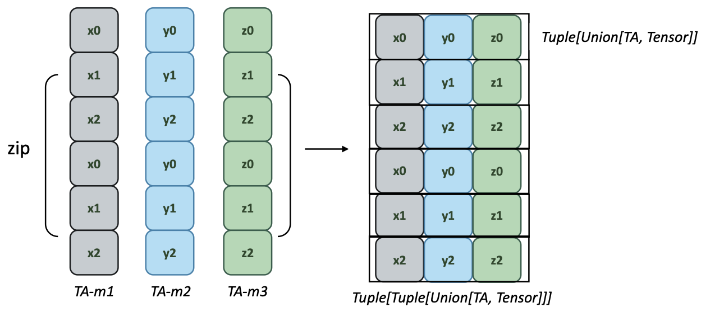
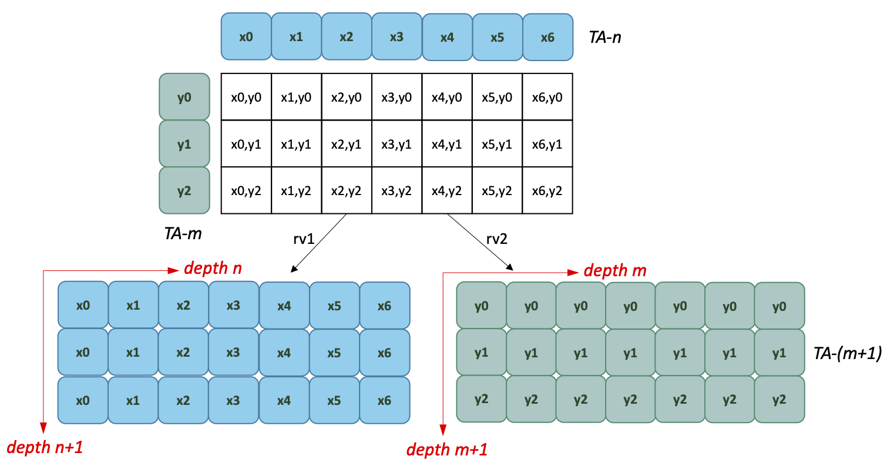

<!-- vscode-markdown-toc -->

- [Access mutiple FractalTensors](#access-mutiple-FractalTensors)
	- [join](#join)
	- [zip](#zip)
	- [product](#product)

<!-- vscode-markdown-toc-config

	numbering=true
	autoSave=true
	/vscode-markdown-toc-config -->

<!-- /vscode-markdown-toc -->

# Access mutiple FractalTensors

Access patterns are not materialized directly. They only affects how parallel functions read the inputs.

## join

Concatenate two type-equivalent FractalTensors into a longer FractalTensor, denoted as $\#$.

$$\mathbf{join}::\Psi n.[\alpha]_n^d \rightarrow \Psi m. [\alpha]_m^d \rightarrow \Psi nm.[\alpha]_{n+m}$$

```python
join(x: FractalTensor[T], y: FractalTensor[T]) -> FractalTensor[T]
```

`x` and `y` should have equivalent types.

Example: join two FractalTensors:

```python
x = [A, B, C, D]
y = [1, 2, 3, 4, 5, 6]

z = join(x, y)
z = [A, B, C, D, 1, 2, 3, 4, 5, 6]
```

$\#$ is an associative operation and has indentity element $\epsilon$ which means:
$$\epsilon \# x = x \# \epsilon = x$$
$$(x \# y) \# z = x \# (y \# z)$$

## zip

`zip` takes a Tuple of FractalTensors and returns a Tuple of tuples of corresponding elements.

$$\mathbf{zip}::(\Psi n.[\alpha]_n^{d_1},...,\Psi n. [\beta]_n^{d_p}) \rightarrow ([\alpha]^{d_1 - 1},...,[\beta^{d_p-1}])$$

```python
zip(*xs: FractalTensor) -> Tuple[Tuple[Union[FractalTensor, Tensor]]]
```

<p align="center">
<br>
Fig 1. zip multiple FractalTensor variables.
</p>

FractalTensors to be zipped should have the same length, otherwise, `zip` fails.

> _#FIXME(ying): in the current document and experimental codes, zip returns Tuple[Tuple[Union[FractalTensor, Tensor]]]. This is not correct. It should return an combinatoric iterator. Similarly, zip and product below are essentially access functions. It is not necessary to directly materialize the access and data movements. An abuse of `Tuple` will lose the logical bundle and structure of FractalTensor which is designed to be manipulated as a whole._

## product

Cartesian product of two FractalTensor which could be type inequivalent.

$$\mathbf{product}::\Psi n.[\alpha]_n^{d_1} \rightarrow \Psi m. [\alpha]_m^{d_2} \rightarrow \Psi nm. [\alpha]^{d_1+1}_{n\times m} \rightarrow \Psi nm.[\alpha]_{n\times m}^{d_2+1}$$

Imagine that the first argument `x` is arranged along the horizontal axis, and the second argument `y` is arranged along the vertical axis as shown in Fig 2. The cartesian product expands `x` and `y` respectively into `FractalTensor` s with an increased depth by 1. For each returned result, the length of the horizontal axis is defined by the length of `x` , and the length of the vertical axis is defined by the length of `y` .

> _The way product returns the results is similar to `meshgrid` in matlab._

```python
product(x: FractalTensor[T1], y: FractalTensor[T2]) -> Tuple[FractalTensor]
```

<p align="center">
<br>
Fig 2. The cartesian product of two FractalTensor variables.
</p>
