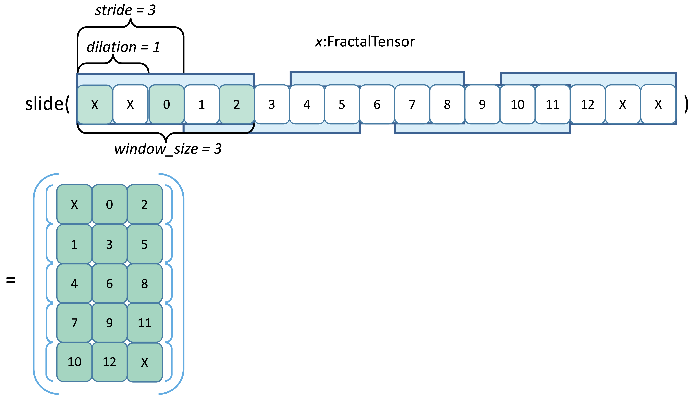
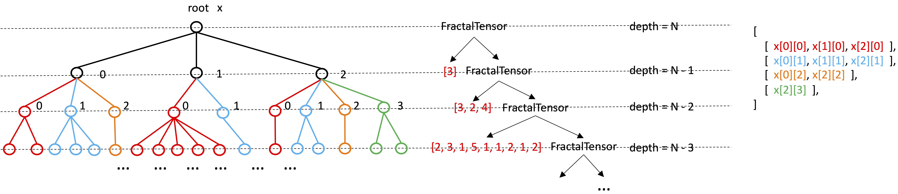
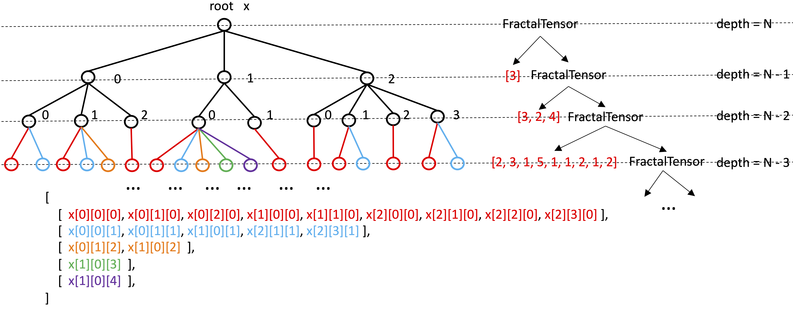

<!-- vscode-markdown-toc -->

- [Extended operations to access a single FractalTensor](#extended-operations-to-access-a-single-fractaltensor)
  - [head and tail](#head-and-tail)
  - [slide](#slide)
  - [[**deprecated**] access_by_depth](#deprecated-access_by_depth)

<!-- vscode-markdown-toc-config
	numbering=true
	autoSave=true
	/vscode-markdown-toc-config -->
<!-- /vscode-markdown-toc -->

# Extended operations to access a single FractalTensor

In the full program, accessing `FractalTensor` is not materialized directly. They encode information of how parallel functions read the inputs.

Extended access APIs are wrappers of accessing primitives. It is not necessary to enumerate and implement them all. They are implemented through access primitives and are all unified into and analyzed as some form of access functions in the IR program.

## head and tail

$$\mathbf{head}::\Psi n.[\alpha]_n^d \rightarrow [\alpha]_1^{[d-1]}$$
$$\mathbf{tail}::\Psi n.[\alpha]_n^d \rightarrow [\alpha]_1^{[d-1]}$$

```python
head(x: FractalTensor[T]) -> T
tail(x: FractalTensor[T]) -> T
```

## slide

```python
slide(input: FractalTensor[T],
      window_size: int,
      stride: int,
      dilation: int,
      padding: int = None,
      padding_value: T = None) -> FractalTensor[FractalTensor[T]]:
```

<p align="center">
<br>
Fig. Apply a sliding window over a FractalTensor variable.
</p>


## [**deprecated**] access_by_depth

_#TODO(ying): this operation is a little bit awkward. Rethink about this._

```python
access_by_depth(x: FractalTensor[T], depth: int) -> FractalTensor[T]
```

Example `x = access_by_depth(x, x.depth)` :

<p align="center">
<br>
Fig. Access a depth-N FractalTensor variable x by the depth N.
</p>

Example `x = access_by_depth(x, x.depth - 1)` :

<p align="center">
<br>
Fig. Access a depth-N FractalTensor variable x by the depth N - 1.
</p>
