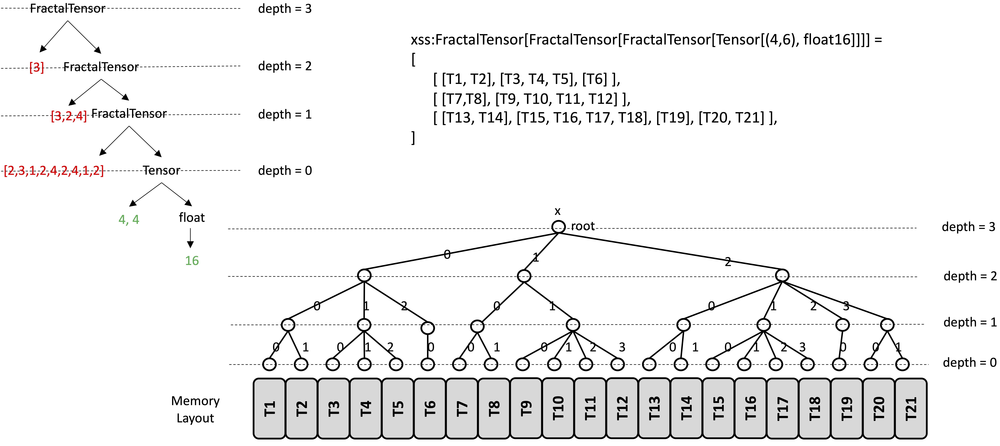
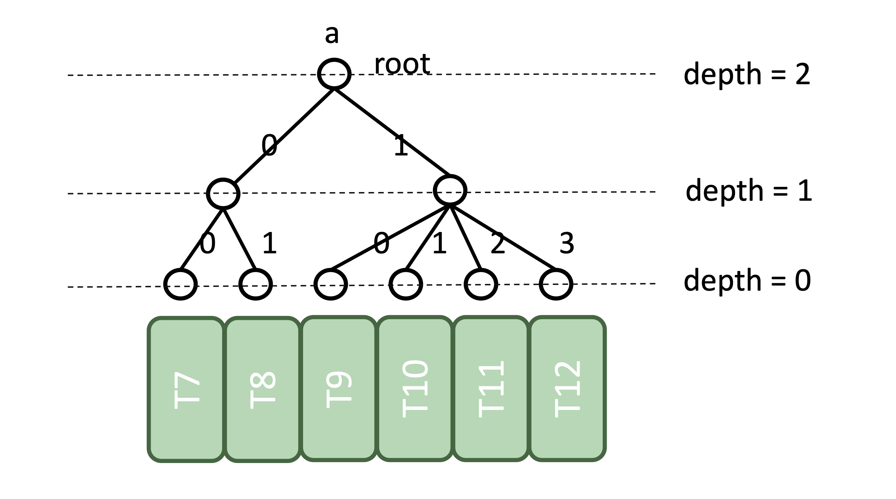
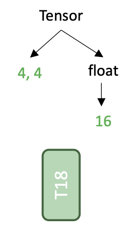

# Memory layout of jagged FractalTensor

`FractalTensor` is a nested collection whose elements could be a set of `FractalTensor` variables. Underneath the hood, a `FractalTensor` is just a convenient way of describing large blocks of computer memory, so that the elements contained could be efficiently iterated over and manipulated.

Recap the constraint of `FractalTensor` :

1. All `FractalTensor` elements (could be integers, tensors, FractalTensors) are homogenous.
1. If two `FractalTensor` types have different depths, they are treated as inequivalent types.

When `FractalTensor` is nested, it is easy to conclude that all tensors contained in a `FractalTensor` have the same depths. The indices of a `FractalTensor` is organized as a tree. At the compile-time, only the depth of the `FractalTensor` is known. The exact structure of the indices tree is not known.

 
Fig 1. The meomory layout of a FractalTensor variable x.

`FractalTensor` supports random read access. Elements contained in a `FractalTensor` can be indexed using the `[]` operator.

Example: `a = x[1]` :

 
Fig 2. index the FractalTensor variable x.

Example: `a = x[2][1][3]` :

 
Fig 3. index the FractalTensor variable x.

