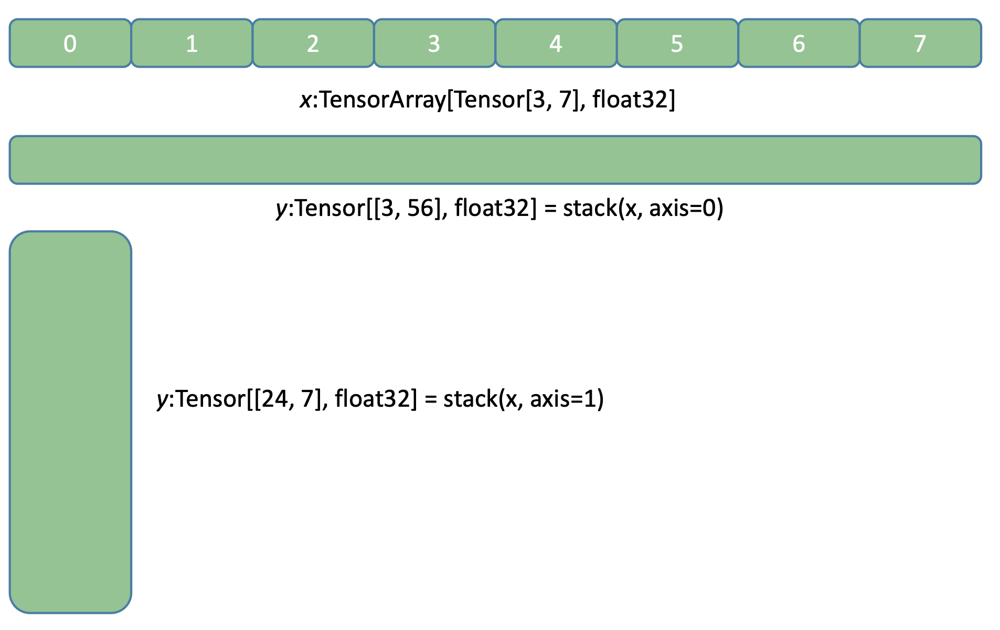

<!-- vscode-markdown-toc -->

- [Memory operations](#memory-operations)
  - [\*copy](#copy)
  - [repeat](#repeat)
  - [stack](#stack)
  - [flatten](#flatten)
  - [split (partition)](#split-partition)

<!-- vscode-markdown-toc-config
	numbering=true
	autoSave=true
	/vscode-markdown-toc-config -->
<!-- /vscode-markdown-toc -->

# Memory operations

## \*copy

```python
copy(x: FractalTensor[T]) -> FractalTensor[T]
```

## repeat

$$\mathbf{repeat} ::\Psi n.[\alpha]^d_n \rightarrow \text{int}\rightarrow \Psi m.[\alpha]^{d}_m$$

```python
repeat(x: FractalTensor[T], repeats: int) -> FractalTensor[T]
```

Examples:

```
x: FractalTensor = [t1, t2, t3]

y: FractalTensor = repeats(x, 3)

y = [t1, t2, t3, t1, t2, t3]
```

## stack

$$\mathbf{stack} ::\Psi n.[\alpha]^1_n \rightarrow \text{int}\rightarrow \beta$$

```python
stack(x: FractalTensor[Tensor], axis: int) -> Tensor
```

`stack` is **ONLY** defined for a depth-1 `FractalTensor` .

Example, suppose `x = FractalTensor[Tensor[3, 7], float32]`

<p align="center">

</p>

## flatten

$$\mathbf{flatten} ::\Psi n.[\alpha]^d_n \rightarrow \text{int}\rightarrow \beta$$

```python
flatten(x: FractalTensor[T], axis: int) -> Tensor
```

`flatten` is equal to retrieve all tensors contained in `x` by positive lexicographic order, put them into a depth-1 `FractalTensor` , and then call `stack` on this depth-1 `FractalTensor` .

## split (partition)

$$\mathbf{split} ::\Psi n.[\alpha]^d_n \rightarrow \text{int}\rightarrow (\Psi m.[\beta]^d_m)$$

Partition a `FractalTensor` into a tuple of `FractalTensor` .

```python
split(x: FractalTensor[T], n: int, pad_value: T = None) -> Tuple[FractalTensor[T]]
```
