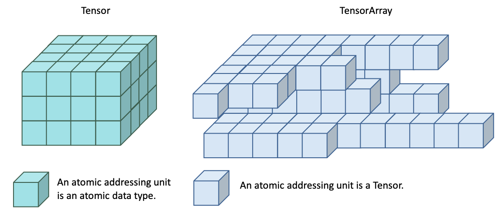
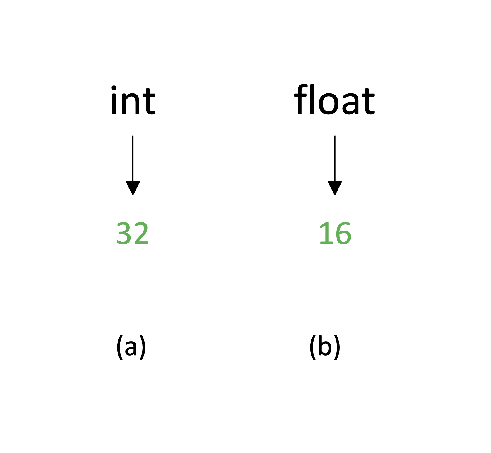
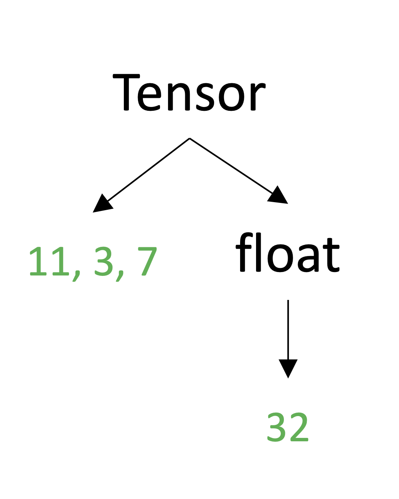
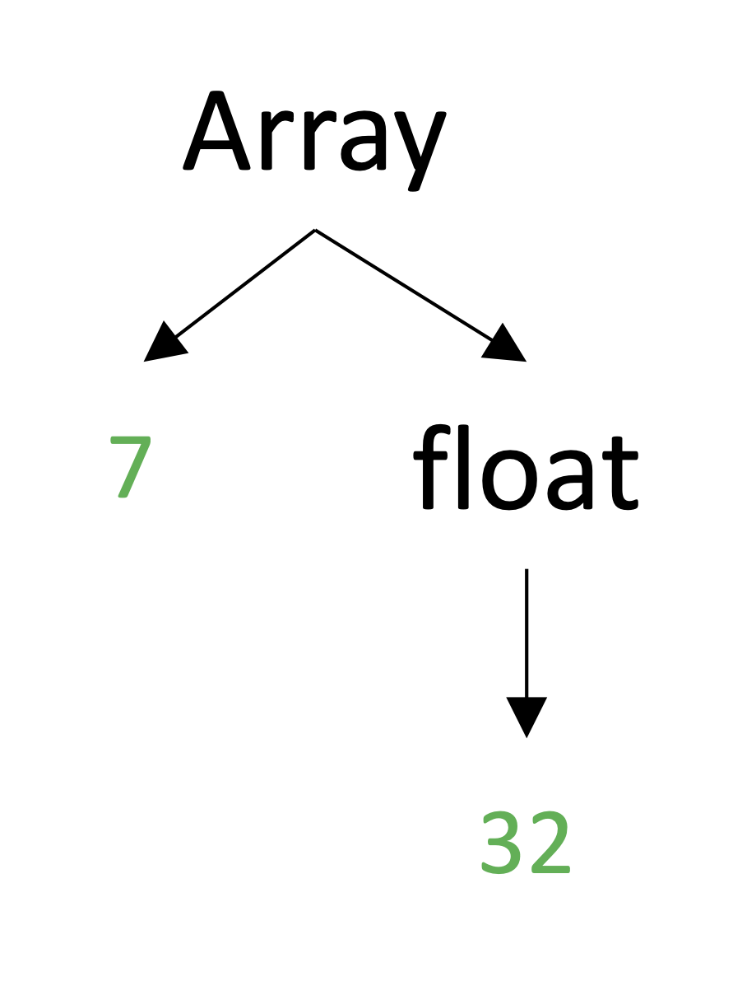
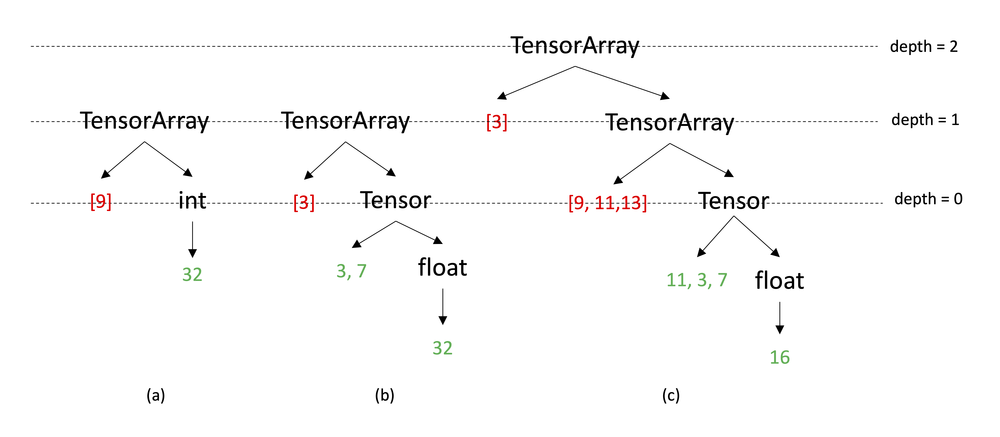

<!-- vscode-markdown-toc -->

- [Primitive types in XXX](#primitive-types-in-xxx)
  - [Atomic data type](#atomic-data-type)
  - [Homogeneous arrays](#homogeneous-arrays)
    - [Arrays of atomic data types with the static shape](#arrays-of-atomic-data-types-with-the-static-shape)
      - [Multi-dimensional array: `Tensor`](#multi-dimensional-array-tensor)
      - [One-dimensional array: `Array`](#one-dimensional-array-array)
    - [Jagged array of Tensor: `FractalTensor`](#jagged-array-of-tensor-FractalTensor)
  - [Type equivalence](#type-equivalence)

<!-- vscode-markdown-toc-config
    numbering=true
    autoSave=true
    /vscode-markdown-toc-config -->
<!-- /vscode-markdown-toc -->

# Primitive types in XXX

XXX does not subsume all the features of a full language. It analyzes programs made up of meta operations on **ONLY** three **atomic data types** that are at the core of numeric computing and two primitive **collection types**.

1. primitive atomic data types:
   - integers(`int`), floats(`float`) and booleans(`bool`)
2. primitive collection types:
   - `Tensor`, a static, grid-ordered homogenous collection of atomic data types
   - `FractalTensor`, a variable-length and sequence-ordered homogenous collection of tensors

Atomic data types, `Tensor` and `FractalTensor` has first-class support in the backend. The abstraction level of data is raised in turn from atomic data types to `FractalTensor`. The size of these primitive types could then be defined inductively: the size of atomic data types is 1, and the size of a `Tensor` is the sum of the sizes of its elements. The size of a nested `FractalTensor` is the sum of its elements at all depths which could therefore be much greater than its length. The design of these primitive types is to make it possible to derive asymptotic complexity from the code as a function of the shape of `Tensor`, or the length and depth of `FractalTensor` used in the programs.

Throughout this document, "`Tensor`" and "`FractalTensor`" that begin with a capital letter particularly indicate types in XXX. "tensor" and "FractalTensor" that begin with a lowercase letter capital indicate variables with the type of `Tensor` and `FractalTensor` respectively.

Fig 1. gives a logical and geometric view of Tensor and FractalTensor abstraction in XXX.

<p align="center">
<br>
Fig 1. The geometric view of two core collection types in XXX.
</p>

All types in XXX have parameters and structures expressed as a tree. Type expression receives type parameters and creates the type structure.

## Atomic data type

Atomic data types are characterized by bit width.

| Name  | Type parameter |
| ----- | -------------- |
| int   | bit-width      |
| float | bit-width      |
| bool  | None           |

<p align="center">
<br>
Fig 2. Type structure created for (a) int32 and (b) float16.
</p>

## Homogeneous arrays

XXX is based on homogeneous collection types: sequences and multi-dimensional arrays as primitive parallel data types. Homogeneous collection types that aggregate multiple elements of the same type form an addressable region of contiguous memory. Operations that iterate over arrays or access array elements derive their performance from the compiler's compile-time program analysis.

XXX particularly presents two kinds of homogenous arrays:

1. Fixed-size array of atomic data types called `Tensor`.
   - Tensor is a grid-ordered collection of atomic data types.
   - Memory size and the exact layout of a `Tensor`-typed variable is known at compile-time and is not changed after type creation.
2. Jagged array of tensors called `FractalTensor`.
   - `FractalTensor` is a sequence-ordered variable-length collection of tensors.
   - `FractalTensor` can be nested.
   - Exact memory size of a FractalTensor-typed variable is not known at compile-time.

### Arrays of atomic data types with the static shape

#### Multi-dimensional array: `Tensor`

The multi-dimensional array with static shape in XXX is called `Tensor`. (The name `Tensor` is mainly to be compatible with mainstream deep learning frameworks' terminology.) `Tensor` is characterized by two type parameters:

1. `dtype`: the type of elements contained in a tensor which can only be one of three atomic data types.
1. `shape`: an ordered tuple of integers that specifies the rank, dimension, and layout of a `Tensor`.

Regarding their positions in the collection, elements of a tensor are ordered by the lexicographic order where the outer axis has a higher order.

Example: type creation of `Tensor`:

```python
a = Tensor(dtype=float32, shape=[11,3,7])
```

<p align="center">
<br>
Fig 3. Type structure created for <font size=2>a:Tensor[float32, [11,3,7]]</font>.
</p>

After type creation, the shape of a tensor **CANNOT** be changed during program analysis and the entire execution of the program (information in green font).

#### One-dimensional array: `Array`

`Array` is a specialization of one-dimensional Tensor. `Array` is declared by specifying two type parameters:

1. `dtype`: array element type that can only be one of the atomic data types.
1. `length`: an integer.

`Array` elements are linearly-ordered by their position in the array.

Example: type creation of `Array`:

```python
a = Array(dtype=float32, length=7)
```

<p align="center">
<br>
Fig 4. Type structure created for <font size=2>a:Array[float32, 7]</font>.
</p>

After type creation, the length of `Array` **CANNOT** be changed during program analysis and the entire execution of the program (information in green color).

### Jagged array of Tensor: `FractalTensor`

`FractalTensor` is a jagged linearly-ordered collection of more primitive type `Array` and `Tensor`, or a `FractalTensor`. A greater degree of flexibility of the `FractalTensor` abstraction is from the fact that **it can be nested for an arbitrary depth**.

Random **READ** access to `FractalTensor` elements (access by indices) is supported, **but random WRITE ACCESS is PROHIBITED**. Manipulate and transform `FractalTensor` elements **HAVE TO** through `FractalTensor` specialized operations which are pure functions. This constraint is to make it possible to automatically generate gradient computations and automatically parallelize operations on FractalTensors.

`FractalTensor` is declared by specifying a single type parameter `dtype` which could be one of `int`, `Array`, `Tensor`, or `FractalTensor`. `FractalTensor` can be declared without a pre-defined length, but specifying `max_length` will help the optimizer search for better heuristics about memory allocation and management.

In XXX, at the moment, `FractalTensor` of numeric data types is **ONLY** implemented for `int`. This is an implementation issue since `FractalTensor` of `int` is particularly a very powerful expressive tool to encode input data of NLP tasks.

1. `FractalTensor` in the perspective of optimization mainly serves as a tool to raise the abstraction level. We are not going to optimize `FractalTensor` of `float` and `bool` at the compiler's front-end passes in XXX, so decide not to specially treat it at the moment.
1. If you do need a variable-length list of `float` and `bool`, it is still possible to create a `FractalTensor` by regarding `float` and `bool` as `Tensor` with a shape `(1,)`, but performance of operations on such a `FractalTensor` with fine-grained data elements is not guaranteed.

Example: type creation of `FractalTensor`:

```python
a = FractalTensor(dtype=int32) # max_length of a FractalTensor variable is None by default

b = FractalTensor(dtype=Tensor(float32, (3,7)))

c = FractalTensor(dtype=FractalTensor(dtype=Tensor(dtype=float16, shape=(11,3,7))))
```

<p align="center">
<br>
Fig 5. Type structure created for <font size=2>FractalTensor</font> variables.
</p>

The information in green font is static, known at compile-time, and does not change after type creation. The information in red font is data-dependent, not available at compile-time, and may change from mini-batch to mini-batch when training a machine learning model.

One of the most important motivations of `FractalTensor` is it is a powerful expressive tool of data in machine learning tasks. Machine learning is a science of modeling data, and data-dependent operations are prevalent in machine learning tasks.

## Type equivalence

Type is the meta info attached to a variable. In XXX, all types are represented by a tree internally as shown in Fig 2 ~ Fig 5.

Suppose `a` and `b` are two types created by the type constructor. They are structurally equivalent if and only if:

1. For atomic data type:
   - `a.name == b.name && a.bit_width = a.bit_width`
1. For Tensor type:
   - `a.name == b.name && a.dtype = b.dtype && a.shape == b.shape`
1. For FractalTensor type:
   - `a.name == b.name && a.dtype = b.dtype && a.depth == b.depth`
