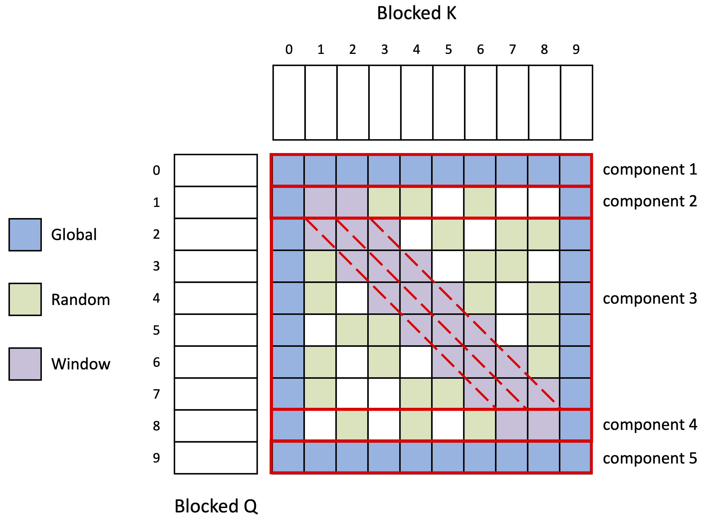

# Hyper-parameters for the BERT model

- batch size of 256 sequences
- each sequence has 512 tokens

||BERT base|BERT large|
|:--|:--|:--|
|number of Transformer blocks ($L$)|12|24|
|hidden size ($H$)|768|1024|
|self-attention head ($A$)|12|16|
|feed-forward/filter = 4$H$ |3072|4096|
|total parameters|110MB|340MB|

# BigBird attending pattern

<p align="center">

</p>


The implementation refers to:

1. https://github.com/google-research/bigbird
1. https://github.com/sanghuynh1501/bigbird_pytorch

Pseudo-codes for the blocked windowed-attention

```c++
qss: List<List<Matrix>>  // batch_size, block_num, [block_size, hidden]
kss: List<List<Matrix>>  // batch_size, block_num, [hidden, block_size]
vss: List<List<Matrix>>  // batch_size, block_num, [block_size, hidden]

wss: List<List<Matrix>>  // batch_size, block_num, [block_size, hidden]

for 0 <= i < len(qss)  // iterate over `batch_size`
  for 2 <= j < len(qss[i]) - 2  // iterate over `block_num`
      for -1 <= k <= 1  // iterate over window size
          // [block_size, hidden] @ [hidden, block_size]
          ss1[k + 1] = qss[i][j] @ kss[i][j + k]
      
      // ss1 has a shape of [block_size, block_size * 3]
      ss2 = softmax(ss1[:])

      // [block_size , block_size * 3] @ [block_size * 3, hidden] 
      wss[i][j] = ss2 @ vss[i][j - 1 : j + 1]
```
