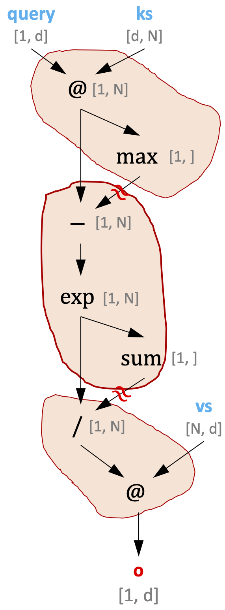
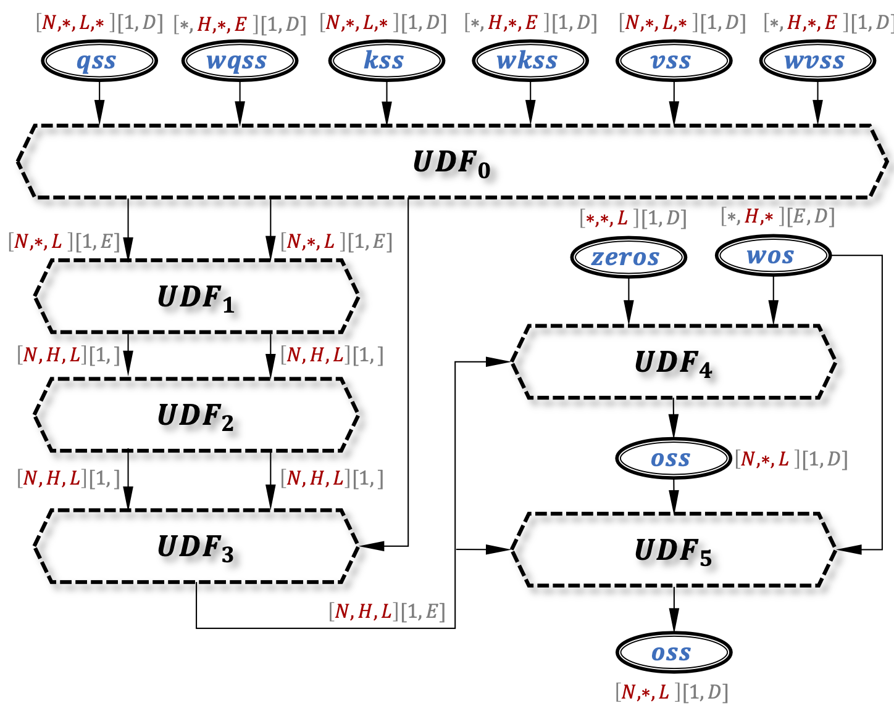
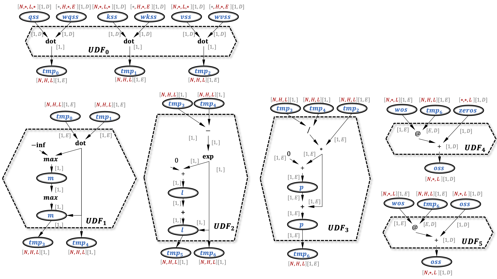
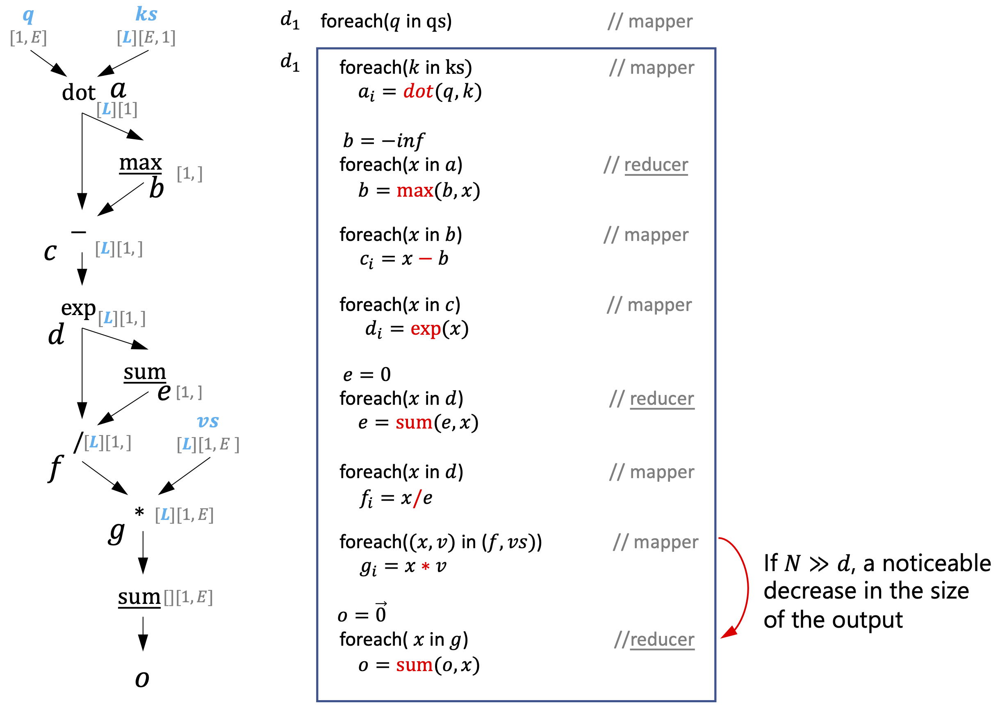

# From the standard attention to flash attention

## The standard attention function

```c++
// inputs: query: [1, d], ks: [d, N], vs: [d, N]

v1:[1, N] = map(k => dot(k, query), ks)
v2:[1,] = reduce(s, x => max(x, s), I = -inf, v1)
v3:[1, N] = map(x => x - v2, v1)
v4:[1, N] = map(x => exp(x), v3)
v5:[1,] = reduce(s, x => s + x, I = 0., v4)
v6:[1, N] = map(x => x / v5, v4)
v7:[1, d] = reduce(x1, x2 => x1 * x2, I = 0., zip(v6, vs))
```
<p align="center">
<br>
Fig. Operator boundaries determined by data dependencies.
</p>

```c++
// Batch, Heads, Length are all symbolic constants

qsss:[Batch][Heads][Length][1, 32] = ...
kss:[Batch][Heads][32, Length] = ...
vss:[Batch][Heads][Length, 32] = ...

wqs:[Heads][32, 32] = ...
wks:[Heads][32, 32] = ...
wvs:[Heads][32, 32] = ...

osss[Batch][Heads][Length] = ...

for (int i = 0; i < Batch; ++i){
    for(int j = 0; j < Heads; ++j){
        for(int k = 0; k < Length; ++k){
            s = qsss[i][j][k] @ wks[j] @ (wks[j] @ kss[i][j]) // [1, Length]
            m = max(s) // [1, ]
            weights = exp(s - m) // [1, Length]
            l = sum(weights) // [1, ]
            softmax = weights / l // [1, Length]
            osss[i][j][k] = softmax @ vss[i][j] @ wvs[j] // [1, 32]
        }
    }
}
```

<p align="center">
<br>
Fig. The original ETDG for the multi-head attention.
</p>

<p align="center">
<br>
Fig. BlockNode fusion for the multi-head attention.
</p>

<p align="center">
<br>
Fig. Elaborate the mapper and reducer in MHA.
</p>
